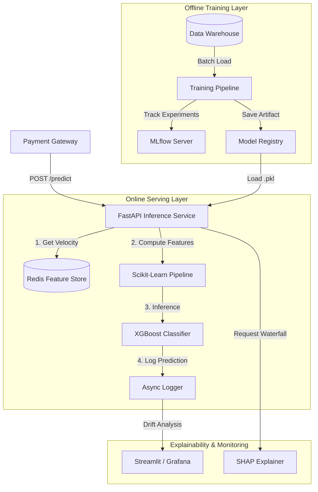

Here is the comprehensive `architecture.md` file for your repository. It documents the high-level system design, data flow, and infrastructure decisions, serving as a critical artifact for technical interviews and system design reviews.

---

# 🏗️ System Architecture: Real-Time Fraud Detection

This document outlines the end-to-end architecture of the Fraud Detection System, designed for **low-latency inference (<50ms)**, **high throughput**, and **explainability**.

The system follows a **Lambda Architecture** pattern, splitting workflows into an **Offline Training Layer** (batch processing) and an **Online Serving Layer** (real-time inference).

---

## 1. High-Level Diagram



---

## 2. Component Breakdown

### 🟢 Online Serving Layer (Real-Time)

The critical path for live transactions. Designed for sub-50ms latency.

* **FastAPI Service:** Asynchronous Python web server. Handles request validation (Pydantic) and orchestrates the inference flow.
* **Redis Feature Store:**
* **Role:** Solves the "Stateful Feature" problem.
* **Implementation:** Uses Redis Sorted Sets (`ZSET`) to maintain a rolling window of transaction counts for the last 24 hours.
* **Latency:** <2ms lookups via pipelining.


* **Inference Engine:**
* **Model:** XGBoost Classifier (serialized via Joblib).
* **Pipeline:** `ColumnTransformer` (WOEEncoder + RobustScaler) ensures raw input is transformed exactly as it was during training.
* **Shadow Mode:** A configuration toggle allowing the model to run silently alongside legacy rules for A/B testing.


### 🔵 Offline Training Layer (Batch)

Where models are built, validated, and versioned.

* **Data Ingestion:** Loads historical transaction logs (CSV/Parquet).
* **Feature Engineering:**
* Calculates Haversine distances.
* Generates Cyclical time encodings (`hour_sin`, `hour_cos`).
* Computes historical aggregates for the Feature Store.
* refer notebook markdown for more information at path notebook/credit-card-fraud-detection.md


* **Experiment Tracking (MLflow):**
* Logs hyperparameters (`max_depth`, `learning_rate`).
* Logs metrics: Precision, Recall, PR-AUC.
* Stores the model artifact and the optimized decision threshold (e.g., `0.895`).


### 🟣 Explainability Layer (Compliance)

Ensures decisions are transparent and auditable.

* **SHAP (SHapley Additive exPlanations):**
* **Global:** Summary plots to understand model drivers.
* **Local:** Waterfall plots generated on-demand for specific high-risk blocks.
* **Optimization:** Uses the TreeExplainer with the "JSON Serialization Patch" to handle XGBoost 2.0+ metadata compatibility.


---

## 3. Data Flow Lifecycle

### Step 1: Request Ingestion

The Payment Gateway sends a raw transaction payload:

```json
{
  "user_id": "u8312",
  "amt": 150.00,
  "lat": 40.7128,
  "long": -74.0060,
  "category": "grocery_pos",
  "job": "systems_analyst"
}

```

### Step 2: Real-Time Feature Enrichment

The API queries Redis to fetch dynamic context that isn't in the payload:

* *Query:* `ZCARD user:u8312:tx_history` (Transactions in last 24h)
* *Result:* `5` (Velocity)

### Step 3: Preprocessing & Inference

The combined vector (Raw + Redis Features) is passed to the Pipeline:

1. **Imputation:** Handle missing values.
2. **Encoding:** `category` -> Weight of Evidence (Float).
3. **Scaling:** `amt` -> RobustScaler (centered/scaled).
4. **Prediction:** XGBoost outputs probability `0.982`.

### Step 4: Decision & Action

* **Threshold Check:** `0.982 > 0.895` → **FRAUD**.
* **Shadow Mode Check:** If enabled, return `APPROVE` but log `[SHADOW_BLOCK]`.
* **Response:**
```json
{
  "status": "BLOCK",
  "risk_score": 0.982,
  "latency_ms": 35
}

```


---

## 4. Deployment Strategy

### Shadow Deployment (Dark Launch)

To mitigate risk, new model versions are deployed in "Shadow Mode" before blocking real money.

1. **Deploy:** Version v2 is deployed to production.
2. **Listen:** It receives 100% of traffic but has **no write permissions** (cannot decline cards).
3. **Compare:** We compare v2's "Virtual Blocks" against the v1 "Actual Blocks" and customer complaints.
4. **Promote:** If Precision > 95% and complaints == 0, toggle Shadow Mode **OFF**.

---

## 5. Technology Stack

| Component | Technology | Rationale |
| --- | --- | --- |
| **Language** | Python 3.10+ | Standard for ML ecosystem. |
| **Package Manager | astral-uv | An extremely fast Python package and project manager |
| **API Framework** | FastAPI | Async native, high performance, auto-documentation. |
| **Model** | XGBoost | Best-in-class for tabular fraud data. |
| **Feature Store** | Redis | Sub-millisecond latency for sliding windows. |
| **Container** | Docker | Reproducible environments. |
| **Orchestration** | Docker Compose | Local development and testing. |
| **Tracking** | MLflow | Experiment management and artifact versioning. |
| **Frontend** | Streamlit | Rapid prototyping of analyst dashboards. |