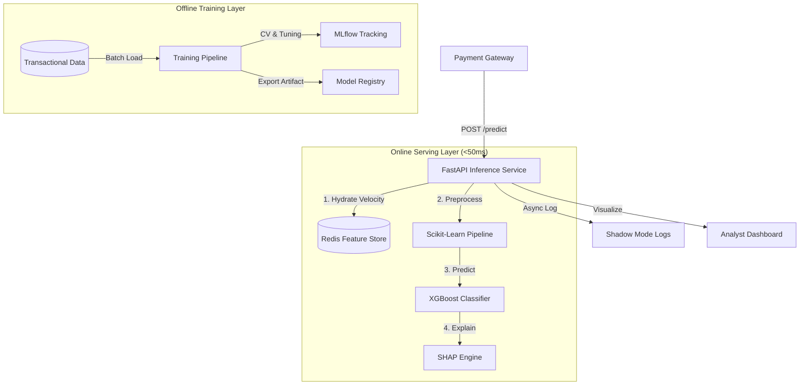
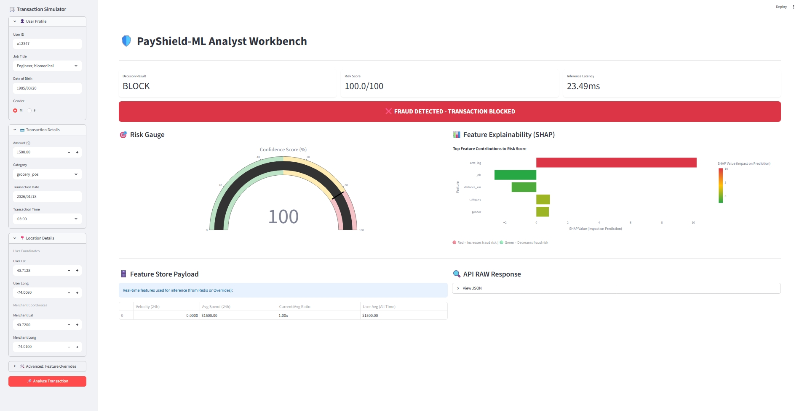

# 🛡️ PayShield-ML:Real-Time Fraud Engine


**A production-grade MLOps system providing low-latency fraud detection with stateful feature hydration and human-in-the-loop explainability.**

---

## 🏗️ System Architecture

The system follows a **Lambda Architecture** pattern, decoupling the high-latency model training from the low-latency inference path.


### 🖥️ Analyst Workbench

*Real-time interface for fraud analysts to review blocked transactions and SHAP explanations.*
---

## 🚀 Key Features

### 1. Stateful Feature Store (Redis)
Traditional stateless APIs struggle with "Velocity Features" (e.g., *how many times did this user swipe in 24 hours?*). Our engine utilizes **Redis Sorted Sets (ZSET)** to maintain rolling windows, allowing feature hydration in **<2ms** with $O(\log N)$ complexity.

### 2. Shadow Mode (Dark Launch)
To mitigate the risk of model drift or false positives, the system supports a **Shadow Mode** configuration. The model runs in production, receives real traffic, and logs decisions, but never blocks a transaction. This allows for risk-free A/B testing against legacy rule engines.

### 3. Business-Aligned Optimization
Standard accuracy is misleading in fraud detection due to class imbalance. We implement a **Recall-Constraint Strategy** (Target: 80% Recall) ensuring the model captures the vast majority of fraud while maintaining a strict upper bound on False Positive Rates, as required by financial compliance.

### 4. Cold-Start Handling
Engineered logic to handle new users with zero history by defaulting to global medians and "warm-up" priors, preventing the system from unfairly blocking legitimate first-time customers.

---

## 📊 Performance & Metrics

The following metrics were achieved on a hold-out temporal test set (out-of-time validation):

| Metric | Result | Target / Bench |
| :--- | :--- | :--- |
| **PR-AUC** | 0.9245 | Excellent |
| **Precision** | 93.18% | Low False Positives |
| **Recall** | 80.06% | Target: 80% |
| **Inference Latency (p95)** | ~30ms | < 50ms |

---

## 🛠️ Quick Start

### Prerequisites
- Docker & Docker Compose
- (Optional) Python 3.12+ (managed via `uv`)

### Installation & Deployment

1. **Clone the Repository**
   ```bash
   git clone https://github.com/Sibikrish3000/realtime-fraud-engine.git
   cd realtime-fraud-engine
   ```

2. **Launch the Stack**
   ```bash
   docker-compose up --build
   ```
   *This starts the FastAPI Backend, Redis Feature Store, and Streamlit Dashboard.*

3. **Access the Services**
   - **Analyst Dashboard:** [http://localhost:8501](http://localhost:8501)
   - **API Documentation:** [http://localhost:8000/docs](http://localhost:8000/docs)
   - **Redis Instance:** `localhost:6379`

---

## 📂 Project Structure

```text
src/
├── api/             # FastAPI service, schemas (Pydantic), and config
├── features/        # Redis feature store logic and sliding window constants
├── models/          # Training pipelines, metrics calculation, and XGBoost wrappers
├── frontend/        # Streamlit-based analyst workbench
├── data/            # Data ingestion and cleaning utilities
└── explainability.py # SHAP-based waterfall plots and global importance


```
See the [Development & MLOps Guide](docs/DEVELOPMENT.md) for detailed instructions on training and local development.
---

## 📡 API Reference

### Predict Transaction
`POST /v1/predict`

**Request:**
```bash
curl -X 'POST' \
  'http://localhost:8000/v1/predict' \
  -H 'Content-Type: application/json' \
  -d '{
    "user_id": "u12345",
    "trans_date_trans_time": "2024-01-20 14:30:00",
    "amt": 150.75,
    "lat": 40.7128,
    "long": -74.0060,
    "merch_lat": 40.7306,
    "merch_long": -73.9352,
    "category": "grocery_pos"
  }'
```

**Response:**
```json
{
  "decision": "APPROVE",
  "probability": 0.12,
  "risk_score": 12.0,
  "latency_ms": 28.5,
  "shadow_mode": false,
  "shap_values": {
    "amt": 0.05,
    "dist": 0.02
  }
}
```

---

## 🗺️ Future Roadmap

- [ ] **Kafka Integration:** Transition to an asynchronous event-driven architecture for high-throughput stream processing.
- [ ] **KServe Deployment:** Migrate from standalone FastAPI to KServe for automated scaling and model versioning.
- [ ] **Graph Features:** Incorporate Neo4j-based features to detect fraud rings and synthetic identities.

---
**Author:** [Sibi Krishnamoorthy](https://github.com/Sibikrish3000)
*Machine Learning Engineer | Fintech & Risk Analytics*
