```python
# Input data files are available in the read-only "../input/" directory
# For example, running this (by clicking run or pressing Shift+Enter) will list all files under the input directory

import os
for dirname, _, filenames in os.walk('/kaggle/input'):
    for filename in filenames:
        print(os.path.join(dirname, filename))

# You can write up to 20GB to the current directory (/kaggle/working/) that gets preserved as output when you create a version using "Save & Run All" 
# You can also write temporary files to /kaggle/temp/, but they won't be saved outside of the current session
```

    /kaggle/input/fraud-detection/fraudTest.csv
    /kaggle/input/fraud-detection/fraudTrain.csv


```python
!pip install --upgrade shap
```

    Requirement already satisfied: shap in /usr/local/lib/python3.12/dist-packages (0.50.0)
    Requirement already satisfied: numpy>=2 in /usr/local/lib/python3.12/dist-packages (from shap) (2.0.2)
    Requirement already satisfied: scipy in /usr/local/lib/python3.12/dist-packages (from shap) (1.15.3)
    Requirement already satisfied: scikit-learn in /usr/local/lib/python3.12/dist-packages (from shap) (1.6.1)
    Requirement already satisfied: pandas in /usr/local/lib/python3.12/dist-packages (from shap) (2.2.2)
    Requirement already satisfied: tqdm>=4.27.0 in /usr/local/lib/python3.12/dist-packages (from shap) (4.67.1)
    Requirement already satisfied: packaging>20.9 in /usr/local/lib/python3.12/dist-packages (from shap) (26.0rc2)
    Requirement already satisfied: slicer==0.0.8 in /usr/local/lib/python3.12/dist-packages (from shap) (0.0.8)
    Requirement already satisfied: numba>=0.54 in /usr/local/lib/python3.12/dist-packages (from shap) (0.60.0)
    Requirement already satisfied: cloudpickle in /usr/local/lib/python3.12/dist-packages (from shap) (3.1.1)
    Requirement already satisfied: typing-extensions in /usr/local/lib/python3.12/dist-packages (from shap) (4.15.0)
    Requirement already satisfied: llvmlite<0.44,>=0.43.0dev0 in /usr/local/lib/python3.12/dist-packages (from numba>=0.54->shap) (0.43.0)
    Requirement already satisfied: python-dateutil>=2.8.2 in /usr/local/lib/python3.12/dist-packages (from pandas->shap) (2.9.0.post0)
    Requirement already satisfied: pytz>=2020.1 in /usr/local/lib/python3.12/dist-packages (from pandas->shap) (2025.2)
    Requirement already satisfied: tzdata>=2022.7 in /usr/local/lib/python3.12/dist-packages (from pandas->shap) (2025.2)
    Requirement already satisfied: joblib>=1.2.0 in /usr/local/lib/python3.12/dist-packages (from scikit-learn->shap) (1.5.3)
    Requirement already satisfied: threadpoolctl>=3.1.0 in /usr/local/lib/python3.12/dist-packages (from scikit-learn->shap) (3.6.0)
    Requirement already satisfied: six>=1.5 in /usr/local/lib/python3.12/dist-packages (from python-dateutil>=2.8.2->pandas->shap) (1.17.0)


```python
import pandas as pd
pd.set_option("display.max_columns",None)
import numpy as np
import matplotlib.pyplot as plt 
import seaborn as sns
sns.set(rc={"figure.figsize":(18,8)},style='darkgrid')
sns.set_palette('rocket')
from time import time
import warnings
warnings.filterwarnings('ignore')
from sklearn.model_selection import TimeSeriesSplit
```


```python
from sklearn.metrics import *
```


```python
train=pd.read_csv("/kaggle/input/fraud-detection/fraudTrain.csv")
train.head()
```


<div>
<style scoped>
    .dataframe tbody tr th:only-of-type {
        vertical-align: middle;
    }

    .dataframe tbody tr th {
        vertical-align: top;
    }

    .dataframe thead th {
        text-align: right;
    }
</style>
<table border="1" class="dataframe">
  <thead>
    <tr style="text-align: right;">
      <th></th>
      <th>Unnamed: 0</th>
      <th>trans_date_trans_time</th>
      <th>cc_num</th>
      <th>merchant</th>
      <th>category</th>
      <th>amt</th>
      <th>first</th>
      <th>last</th>
      <th>gender</th>
      <th>street</th>
      <th>city</th>
      <th>state</th>
      <th>zip</th>
      <th>lat</th>
      <th>long</th>
      <th>city_pop</th>
      <th>job</th>
      <th>dob</th>
      <th>trans_num</th>
      <th>unix_time</th>
      <th>merch_lat</th>
      <th>merch_long</th>
      <th>is_fraud</th>
    </tr>
  </thead>
  <tbody>
    <tr>
      <th>0</th>
      <td>0</td>
      <td>2019-01-01 00:00:18</td>
      <td>2703186189652095</td>
      <td>fraud_Rippin, Kub and Mann</td>
      <td>misc_net</td>
      <td>4.97</td>
      <td>Jennifer</td>
      <td>Banks</td>
      <td>F</td>
      <td>561 Perry Cove</td>
      <td>Moravian Falls</td>
      <td>NC</td>
      <td>28654</td>
      <td>36.0788</td>
      <td>-81.1781</td>
      <td>3495</td>
      <td>Psychologist, counselling</td>
      <td>1988-03-09</td>
      <td>0b242abb623afc578575680df30655b9</td>
      <td>1325376018</td>
      <td>36.011293</td>
      <td>-82.048315</td>
      <td>0</td>
    </tr>
    <tr>
      <th>1</th>
      <td>1</td>
      <td>2019-01-01 00:00:44</td>
      <td>630423337322</td>
      <td>fraud_Heller, Gutmann and Zieme</td>
      <td>grocery_pos</td>
      <td>107.23</td>
      <td>Stephanie</td>
      <td>Gill</td>
      <td>F</td>
      <td>43039 Riley Greens Suite 393</td>
      <td>Orient</td>
      <td>WA</td>
      <td>99160</td>
      <td>48.8878</td>
      <td>-118.2105</td>
      <td>149</td>
      <td>Special educational needs teacher</td>
      <td>1978-06-21</td>
      <td>1f76529f8574734946361c461b024d99</td>
      <td>1325376044</td>
      <td>49.159047</td>
      <td>-118.186462</td>
      <td>0</td>
    </tr>
    <tr>
      <th>2</th>
      <td>2</td>
      <td>2019-01-01 00:00:51</td>
      <td>38859492057661</td>
      <td>fraud_Lind-Buckridge</td>
      <td>entertainment</td>
      <td>220.11</td>
      <td>Edward</td>
      <td>Sanchez</td>
      <td>M</td>
      <td>594 White Dale Suite 530</td>
      <td>Malad City</td>
      <td>ID</td>
      <td>83252</td>
      <td>42.1808</td>
      <td>-112.2620</td>
      <td>4154</td>
      <td>Nature conservation officer</td>
      <td>1962-01-19</td>
      <td>a1a22d70485983eac12b5b88dad1cf95</td>
      <td>1325376051</td>
      <td>43.150704</td>
      <td>-112.154481</td>
      <td>0</td>
    </tr>
    <tr>
      <th>3</th>
      <td>3</td>
      <td>2019-01-01 00:01:16</td>
      <td>3534093764340240</td>
      <td>fraud_Kutch, Hermiston and Farrell</td>
      <td>gas_transport</td>
      <td>45.00</td>
      <td>Jeremy</td>
      <td>White</td>
      <td>M</td>
      <td>9443 Cynthia Court Apt. 038</td>
      <td>Boulder</td>
      <td>MT</td>
      <td>59632</td>
      <td>46.2306</td>
      <td>-112.1138</td>
      <td>1939</td>
      <td>Patent attorney</td>
      <td>1967-01-12</td>
      <td>6b849c168bdad6f867558c3793159a81</td>
      <td>1325376076</td>
      <td>47.034331</td>
      <td>-112.561071</td>
      <td>0</td>
    </tr>
    <tr>
      <th>4</th>
      <td>4</td>
      <td>2019-01-01 00:03:06</td>
      <td>375534208663984</td>
      <td>fraud_Keeling-Crist</td>
      <td>misc_pos</td>
      <td>41.96</td>
      <td>Tyler</td>
      <td>Garcia</td>
      <td>M</td>
      <td>408 Bradley Rest</td>
      <td>Doe Hill</td>
      <td>VA</td>
      <td>24433</td>
      <td>38.4207</td>
      <td>-79.4629</td>
      <td>99</td>
      <td>Dance movement psychotherapist</td>
      <td>1986-03-28</td>
      <td>a41d7549acf90789359a9aa5346dcb46</td>
      <td>1325376186</td>
      <td>38.674999</td>
      <td>-78.632459</td>
      <td>0</td>
    </tr>
  </tbody>
</table>
</div>


```python
test=pd.read_csv("/kaggle/input/fraud-detection/fraudTest.csv")
test.head()

```


<div>
<style scoped>
    .dataframe tbody tr th:only-of-type {
        vertical-align: middle;
    }

    .dataframe tbody tr th {
        vertical-align: top;
    }

    .dataframe thead th {
        text-align: right;
    }
</style>
<table border="1" class="dataframe">
  <thead>
    <tr style="text-align: right;">
      <th></th>
      <th>Unnamed: 0</th>
      <th>trans_date_trans_time</th>
      <th>cc_num</th>
      <th>merchant</th>
      <th>category</th>
      <th>amt</th>
      <th>first</th>
      <th>last</th>
      <th>gender</th>
      <th>street</th>
      <th>city</th>
      <th>state</th>
      <th>zip</th>
      <th>lat</th>
      <th>long</th>
      <th>city_pop</th>
      <th>job</th>
      <th>dob</th>
      <th>trans_num</th>
      <th>unix_time</th>
      <th>merch_lat</th>
      <th>merch_long</th>
      <th>is_fraud</th>
    </tr>
  </thead>
  <tbody>
    <tr>
      <th>0</th>
      <td>0</td>
      <td>2020-06-21 12:14:25</td>
      <td>2291163933867244</td>
      <td>fraud_Kirlin and Sons</td>
      <td>personal_care</td>
      <td>2.86</td>
      <td>Jeff</td>
      <td>Elliott</td>
      <td>M</td>
      <td>351 Darlene Green</td>
      <td>Columbia</td>
      <td>SC</td>
      <td>29209</td>
      <td>33.9659</td>
      <td>-80.9355</td>
      <td>333497</td>
      <td>Mechanical engineer</td>
      <td>1968-03-19</td>
      <td>2da90c7d74bd46a0caf3777415b3ebd3</td>
      <td>1371816865</td>
      <td>33.986391</td>
      <td>-81.200714</td>
      <td>0</td>
    </tr>
    <tr>
      <th>1</th>
      <td>1</td>
      <td>2020-06-21 12:14:33</td>
      <td>3573030041201292</td>
      <td>fraud_Sporer-Keebler</td>
      <td>personal_care</td>
      <td>29.84</td>
      <td>Joanne</td>
      <td>Williams</td>
      <td>F</td>
      <td>3638 Marsh Union</td>
      <td>Altonah</td>
      <td>UT</td>
      <td>84002</td>
      <td>40.3207</td>
      <td>-110.4360</td>
      <td>302</td>
      <td>Sales professional, IT</td>
      <td>1990-01-17</td>
      <td>324cc204407e99f51b0d6ca0055005e7</td>
      <td>1371816873</td>
      <td>39.450498</td>
      <td>-109.960431</td>
      <td>0</td>
    </tr>
    <tr>
      <th>2</th>
      <td>2</td>
      <td>2020-06-21 12:14:53</td>
      <td>3598215285024754</td>
      <td>fraud_Swaniawski, Nitzsche and Welch</td>
      <td>health_fitness</td>
      <td>41.28</td>
      <td>Ashley</td>
      <td>Lopez</td>
      <td>F</td>
      <td>9333 Valentine Point</td>
      <td>Bellmore</td>
      <td>NY</td>
      <td>11710</td>
      <td>40.6729</td>
      <td>-73.5365</td>
      <td>34496</td>
      <td>Librarian, public</td>
      <td>1970-10-21</td>
      <td>c81755dbbbea9d5c77f094348a7579be</td>
      <td>1371816893</td>
      <td>40.495810</td>
      <td>-74.196111</td>
      <td>0</td>
    </tr>
    <tr>
      <th>3</th>
      <td>3</td>
      <td>2020-06-21 12:15:15</td>
      <td>3591919803438423</td>
      <td>fraud_Haley Group</td>
      <td>misc_pos</td>
      <td>60.05</td>
      <td>Brian</td>
      <td>Williams</td>
      <td>M</td>
      <td>32941 Krystal Mill Apt. 552</td>
      <td>Titusville</td>
      <td>FL</td>
      <td>32780</td>
      <td>28.5697</td>
      <td>-80.8191</td>
      <td>54767</td>
      <td>Set designer</td>
      <td>1987-07-25</td>
      <td>2159175b9efe66dc301f149d3d5abf8c</td>
      <td>1371816915</td>
      <td>28.812398</td>
      <td>-80.883061</td>
      <td>0</td>
    </tr>
    <tr>
      <th>4</th>
      <td>4</td>
      <td>2020-06-21 12:15:17</td>
      <td>3526826139003047</td>
      <td>fraud_Johnston-Casper</td>
      <td>travel</td>
      <td>3.19</td>
      <td>Nathan</td>
      <td>Massey</td>
      <td>M</td>
      <td>5783 Evan Roads Apt. 465</td>
      <td>Falmouth</td>
      <td>MI</td>
      <td>49632</td>
      <td>44.2529</td>
      <td>-85.0170</td>
      <td>1126</td>
      <td>Furniture designer</td>
      <td>1955-07-06</td>
      <td>57ff021bd3f328f8738bb535c302a31b</td>
      <td>1371816917</td>
      <td>44.959148</td>
      <td>-85.884734</td>
      <td>0</td>
    </tr>
  </tbody>
</table>
</div>


```python
test["split"]="test"
train["split"]="train"
df=pd.concat([train,test],axis=0).reset_index(drop=True)
df.head()
```


<div>
<style scoped>
    .dataframe tbody tr th:only-of-type {
        vertical-align: middle;
    }

    .dataframe tbody tr th {
        vertical-align: top;
    }

    .dataframe thead th {
        text-align: right;
    }
</style>
<table border="1" class="dataframe">
  <thead>
    <tr style="text-align: right;">
      <th></th>
      <th>Unnamed: 0</th>
      <th>trans_date_trans_time</th>
      <th>cc_num</th>
      <th>merchant</th>
      <th>category</th>
      <th>amt</th>
      <th>first</th>
      <th>last</th>
      <th>gender</th>
      <th>street</th>
      <th>city</th>
      <th>state</th>
      <th>zip</th>
      <th>lat</th>
      <th>long</th>
      <th>city_pop</th>
      <th>job</th>
      <th>dob</th>
      <th>trans_num</th>
      <th>unix_time</th>
      <th>merch_lat</th>
      <th>merch_long</th>
      <th>is_fraud</th>
      <th>split</th>
    </tr>
  </thead>
  <tbody>
    <tr>
      <th>0</th>
      <td>0</td>
      <td>2019-01-01 00:00:18</td>
      <td>2703186189652095</td>
      <td>fraud_Rippin, Kub and Mann</td>
      <td>misc_net</td>
      <td>4.97</td>
      <td>Jennifer</td>
      <td>Banks</td>
      <td>F</td>
      <td>561 Perry Cove</td>
      <td>Moravian Falls</td>
      <td>NC</td>
      <td>28654</td>
      <td>36.0788</td>
      <td>-81.1781</td>
      <td>3495</td>
      <td>Psychologist, counselling</td>
      <td>1988-03-09</td>
      <td>0b242abb623afc578575680df30655b9</td>
      <td>1325376018</td>
      <td>36.011293</td>
      <td>-82.048315</td>
      <td>0</td>
      <td>train</td>
    </tr>
    <tr>
      <th>1</th>
      <td>1</td>
      <td>2019-01-01 00:00:44</td>
      <td>630423337322</td>
      <td>fraud_Heller, Gutmann and Zieme</td>
      <td>grocery_pos</td>
      <td>107.23</td>
      <td>Stephanie</td>
      <td>Gill</td>
      <td>F</td>
      <td>43039 Riley Greens Suite 393</td>
      <td>Orient</td>
      <td>WA</td>
      <td>99160</td>
      <td>48.8878</td>
      <td>-118.2105</td>
      <td>149</td>
      <td>Special educational needs teacher</td>
      <td>1978-06-21</td>
      <td>1f76529f8574734946361c461b024d99</td>
      <td>1325376044</td>
      <td>49.159047</td>
      <td>-118.186462</td>
      <td>0</td>
      <td>train</td>
    </tr>
    <tr>
      <th>2</th>
      <td>2</td>
      <td>2019-01-01 00:00:51</td>
      <td>38859492057661</td>
      <td>fraud_Lind-Buckridge</td>
      <td>entertainment</td>
      <td>220.11</td>
      <td>Edward</td>
      <td>Sanchez</td>
      <td>M</td>
      <td>594 White Dale Suite 530</td>
      <td>Malad City</td>
      <td>ID</td>
      <td>83252</td>
      <td>42.1808</td>
      <td>-112.2620</td>
      <td>4154</td>
      <td>Nature conservation officer</td>
      <td>1962-01-19</td>
      <td>a1a22d70485983eac12b5b88dad1cf95</td>
      <td>1325376051</td>
      <td>43.150704</td>
      <td>-112.154481</td>
      <td>0</td>
      <td>train</td>
    </tr>
    <tr>
      <th>3</th>
      <td>3</td>
      <td>2019-01-01 00:01:16</td>
      <td>3534093764340240</td>
      <td>fraud_Kutch, Hermiston and Farrell</td>
      <td>gas_transport</td>
      <td>45.00</td>
      <td>Jeremy</td>
      <td>White</td>
      <td>M</td>
      <td>9443 Cynthia Court Apt. 038</td>
      <td>Boulder</td>
      <td>MT</td>
      <td>59632</td>
      <td>46.2306</td>
      <td>-112.1138</td>
      <td>1939</td>
      <td>Patent attorney</td>
      <td>1967-01-12</td>
      <td>6b849c168bdad6f867558c3793159a81</td>
      <td>1325376076</td>
      <td>47.034331</td>
      <td>-112.561071</td>
      <td>0</td>
      <td>train</td>
    </tr>
    <tr>
      <th>4</th>
      <td>4</td>
      <td>2019-01-01 00:03:06</td>
      <td>375534208663984</td>
      <td>fraud_Keeling-Crist</td>
      <td>misc_pos</td>
      <td>41.96</td>
      <td>Tyler</td>
      <td>Garcia</td>
      <td>M</td>
      <td>408 Bradley Rest</td>
      <td>Doe Hill</td>
      <td>VA</td>
      <td>24433</td>
      <td>38.4207</td>
      <td>-79.4629</td>
      <td>99</td>
      <td>Dance movement psychotherapist</td>
      <td>1986-03-28</td>
      <td>a41d7549acf90789359a9aa5346dcb46</td>
      <td>1325376186</td>
      <td>38.674999</td>
      <td>-78.632459</td>
      <td>0</td>
      <td>train</td>
    </tr>
  </tbody>
</table>
</div>


```python
df.info()
```

    <class 'pandas.core.frame.DataFrame'>
    RangeIndex: 1852394 entries, 0 to 1852393
    Data columns (total 24 columns):
     #   Column                 Dtype  
    ---  ------                 -----  
     0   Unnamed: 0             int64  
     1   trans_date_trans_time  object 
     2   cc_num                 int64  
     3   merchant               object 
     4   category               object 
     5   amt                    float64
     6   first                  object 
     7   last                   object 
     8   gender                 object 
     9   street                 object 
     10  city                   object 
     11  state                  object 
     12  zip                    int64  
     13  lat                    float64
     14  long                   float64
     15  city_pop               int64  
     16  job                    object 
     17  dob                    object 
     18  trans_num              object 
     19  unix_time              int64  
     20  merch_lat              float64
     21  merch_long             float64
     22  is_fraud               int64  
     23  split                  object 
    dtypes: float64(5), int64(6), object(13)
    memory usage: 339.2+ MB


```python
df.describe()
```


<div>
<style scoped>
    .dataframe tbody tr th:only-of-type {
        vertical-align: middle;
    }

    .dataframe tbody tr th {
        vertical-align: top;
    }

    .dataframe thead th {
        text-align: right;
    }
</style>
<table border="1" class="dataframe">
  <thead>
    <tr style="text-align: right;">
      <th></th>
      <th>Unnamed: 0</th>
      <th>cc_num</th>
      <th>amt</th>
      <th>zip</th>
      <th>lat</th>
      <th>long</th>
      <th>city_pop</th>
      <th>unix_time</th>
      <th>merch_lat</th>
      <th>merch_long</th>
      <th>is_fraud</th>
    </tr>
  </thead>
  <tbody>
    <tr>
      <th>count</th>
      <td>1.852394e+06</td>
      <td>1.852394e+06</td>
      <td>1.852394e+06</td>
      <td>1.852394e+06</td>
      <td>1.852394e+06</td>
      <td>1.852394e+06</td>
      <td>1.852394e+06</td>
      <td>1.852394e+06</td>
      <td>1.852394e+06</td>
      <td>1.852394e+06</td>
      <td>1.852394e+06</td>
    </tr>
    <tr>
      <th>mean</th>
      <td>5.371934e+05</td>
      <td>4.173860e+17</td>
      <td>7.006357e+01</td>
      <td>4.881326e+04</td>
      <td>3.853931e+01</td>
      <td>-9.022783e+01</td>
      <td>8.864367e+04</td>
      <td>1.358674e+09</td>
      <td>3.853898e+01</td>
      <td>-9.022794e+01</td>
      <td>5.210015e-03</td>
    </tr>
    <tr>
      <th>std</th>
      <td>3.669110e+05</td>
      <td>1.309115e+18</td>
      <td>1.592540e+02</td>
      <td>2.688185e+04</td>
      <td>5.071470e+00</td>
      <td>1.374789e+01</td>
      <td>3.014876e+05</td>
      <td>1.819508e+07</td>
      <td>5.105604e+00</td>
      <td>1.375969e+01</td>
      <td>7.199217e-02</td>
    </tr>
    <tr>
      <th>min</th>
      <td>0.000000e+00</td>
      <td>6.041621e+10</td>
      <td>1.000000e+00</td>
      <td>1.257000e+03</td>
      <td>2.002710e+01</td>
      <td>-1.656723e+02</td>
      <td>2.300000e+01</td>
      <td>1.325376e+09</td>
      <td>1.902742e+01</td>
      <td>-1.666716e+02</td>
      <td>0.000000e+00</td>
    </tr>
    <tr>
      <th>25%</th>
      <td>2.315490e+05</td>
      <td>1.800429e+14</td>
      <td>9.640000e+00</td>
      <td>2.623700e+04</td>
      <td>3.466890e+01</td>
      <td>-9.679800e+01</td>
      <td>7.410000e+02</td>
      <td>1.343017e+09</td>
      <td>3.474012e+01</td>
      <td>-9.689944e+01</td>
      <td>0.000000e+00</td>
    </tr>
    <tr>
      <th>50%</th>
      <td>4.630980e+05</td>
      <td>3.521417e+15</td>
      <td>4.745000e+01</td>
      <td>4.817400e+04</td>
      <td>3.935430e+01</td>
      <td>-8.747690e+01</td>
      <td>2.443000e+03</td>
      <td>1.357089e+09</td>
      <td>3.936890e+01</td>
      <td>-8.744069e+01</td>
      <td>0.000000e+00</td>
    </tr>
    <tr>
      <th>75%</th>
      <td>8.335758e+05</td>
      <td>4.642255e+15</td>
      <td>8.310000e+01</td>
      <td>7.204200e+04</td>
      <td>4.194040e+01</td>
      <td>-8.015800e+01</td>
      <td>2.032800e+04</td>
      <td>1.374581e+09</td>
      <td>4.195626e+01</td>
      <td>-8.024511e+01</td>
      <td>0.000000e+00</td>
    </tr>
    <tr>
      <th>max</th>
      <td>1.296674e+06</td>
      <td>4.992346e+18</td>
      <td>2.894890e+04</td>
      <td>9.992100e+04</td>
      <td>6.669330e+01</td>
      <td>-6.795030e+01</td>
      <td>2.906700e+06</td>
      <td>1.388534e+09</td>
      <td>6.751027e+01</td>
      <td>-6.695090e+01</td>
      <td>1.000000e+00</td>
    </tr>
  </tbody>
</table>
</div>


```python
df.isnull().sum()
```


    Unnamed: 0               0
    trans_date_trans_time    0
    cc_num                   0
    merchant                 0
    category                 0
    amt                      0
    first                    0
    last                     0
    gender                   0
    street                   0
    city                     0
    state                    0
    zip                      0
    lat                      0
    long                     0
    city_pop                 0
    job                      0
    dob                      0
    trans_num                0
    unix_time                0
    merch_lat                0
    merch_long               0
    is_fraud                 0
    split                    0
    dtype: int64


```python
df.duplicated().sum()
```


    np.int64(0)


```python
df.columns
```


    Index(['Unnamed: 0', 'trans_date_trans_time', 'cc_num', 'merchant', 'category',
           'amt', 'first', 'last', 'gender', 'street', 'city', 'state', 'zip',
           'lat', 'long', 'city_pop', 'job', 'dob', 'trans_num', 'unix_time',
           'merch_lat', 'merch_long', 'is_fraud', 'split'],
          dtype='object')


```python
df.drop(columns=['Unnamed: 0','first', 'last','trans_num','street','state'],inplace=True)
df
```


<div>
<style scoped>
    .dataframe tbody tr th:only-of-type {
        vertical-align: middle;
    }

    .dataframe tbody tr th {
        vertical-align: top;
    }

    .dataframe thead th {
        text-align: right;
    }
</style>
<table border="1" class="dataframe">
  <thead>
    <tr style="text-align: right;">
      <th></th>
      <th>trans_date_trans_time</th>
      <th>cc_num</th>
      <th>merchant</th>
      <th>category</th>
      <th>amt</th>
      <th>gender</th>
      <th>city</th>
      <th>zip</th>
      <th>lat</th>
      <th>long</th>
      <th>city_pop</th>
      <th>job</th>
      <th>dob</th>
      <th>unix_time</th>
      <th>merch_lat</th>
      <th>merch_long</th>
      <th>is_fraud</th>
      <th>split</th>
    </tr>
  </thead>
  <tbody>
    <tr>
      <th>0</th>
      <td>2019-01-01 00:00:18</td>
      <td>2703186189652095</td>
      <td>fraud_Rippin, Kub and Mann</td>
      <td>misc_net</td>
      <td>4.97</td>
      <td>F</td>
      <td>Moravian Falls</td>
      <td>28654</td>
      <td>36.0788</td>
      <td>-81.1781</td>
      <td>3495</td>
      <td>Psychologist, counselling</td>
      <td>1988-03-09</td>
      <td>1325376018</td>
      <td>36.011293</td>
      <td>-82.048315</td>
      <td>0</td>
      <td>train</td>
    </tr>
    <tr>
      <th>1</th>
      <td>2019-01-01 00:00:44</td>
      <td>630423337322</td>
      <td>fraud_Heller, Gutmann and Zieme</td>
      <td>grocery_pos</td>
      <td>107.23</td>
      <td>F</td>
      <td>Orient</td>
      <td>99160</td>
      <td>48.8878</td>
      <td>-118.2105</td>
      <td>149</td>
      <td>Special educational needs teacher</td>
      <td>1978-06-21</td>
      <td>1325376044</td>
      <td>49.159047</td>
      <td>-118.186462</td>
      <td>0</td>
      <td>train</td>
    </tr>
    <tr>
      <th>2</th>
      <td>2019-01-01 00:00:51</td>
      <td>38859492057661</td>
      <td>fraud_Lind-Buckridge</td>
      <td>entertainment</td>
      <td>220.11</td>
      <td>M</td>
      <td>Malad City</td>
      <td>83252</td>
      <td>42.1808</td>
      <td>-112.2620</td>
      <td>4154</td>
      <td>Nature conservation officer</td>
      <td>1962-01-19</td>
      <td>1325376051</td>
      <td>43.150704</td>
      <td>-112.154481</td>
      <td>0</td>
      <td>train</td>
    </tr>
    <tr>
      <th>3</th>
      <td>2019-01-01 00:01:16</td>
      <td>3534093764340240</td>
      <td>fraud_Kutch, Hermiston and Farrell</td>
      <td>gas_transport</td>
      <td>45.00</td>
      <td>M</td>
      <td>Boulder</td>
      <td>59632</td>
      <td>46.2306</td>
      <td>-112.1138</td>
      <td>1939</td>
      <td>Patent attorney</td>
      <td>1967-01-12</td>
      <td>1325376076</td>
      <td>47.034331</td>
      <td>-112.561071</td>
      <td>0</td>
      <td>train</td>
    </tr>
    <tr>
      <th>4</th>
      <td>2019-01-01 00:03:06</td>
      <td>375534208663984</td>
      <td>fraud_Keeling-Crist</td>
      <td>misc_pos</td>
      <td>41.96</td>
      <td>M</td>
      <td>Doe Hill</td>
      <td>24433</td>
      <td>38.4207</td>
      <td>-79.4629</td>
      <td>99</td>
      <td>Dance movement psychotherapist</td>
      <td>1986-03-28</td>
      <td>1325376186</td>
      <td>38.674999</td>
      <td>-78.632459</td>
      <td>0</td>
      <td>train</td>
    </tr>
    <tr>
      <th>...</th>
      <td>...</td>
      <td>...</td>
      <td>...</td>
      <td>...</td>
      <td>...</td>
      <td>...</td>
      <td>...</td>
      <td>...</td>
      <td>...</td>
      <td>...</td>
      <td>...</td>
      <td>...</td>
      <td>...</td>
      <td>...</td>
      <td>...</td>
      <td>...</td>
      <td>...</td>
      <td>...</td>
    </tr>
    <tr>
      <th>1852389</th>
      <td>2020-12-31 23:59:07</td>
      <td>30560609640617</td>
      <td>fraud_Reilly and Sons</td>
      <td>health_fitness</td>
      <td>43.77</td>
      <td>M</td>
      <td>Luray</td>
      <td>63453</td>
      <td>40.4931</td>
      <td>-91.8912</td>
      <td>519</td>
      <td>Town planner</td>
      <td>1966-02-13</td>
      <td>1388534347</td>
      <td>39.946837</td>
      <td>-91.333331</td>
      <td>0</td>
      <td>test</td>
    </tr>
    <tr>
      <th>1852390</th>
      <td>2020-12-31 23:59:09</td>
      <td>3556613125071656</td>
      <td>fraud_Hoppe-Parisian</td>
      <td>kids_pets</td>
      <td>111.84</td>
      <td>M</td>
      <td>Lake Jackson</td>
      <td>77566</td>
      <td>29.0393</td>
      <td>-95.4401</td>
      <td>28739</td>
      <td>Futures trader</td>
      <td>1999-12-27</td>
      <td>1388534349</td>
      <td>29.661049</td>
      <td>-96.186633</td>
      <td>0</td>
      <td>test</td>
    </tr>
    <tr>
      <th>1852391</th>
      <td>2020-12-31 23:59:15</td>
      <td>6011724471098086</td>
      <td>fraud_Rau-Robel</td>
      <td>kids_pets</td>
      <td>86.88</td>
      <td>F</td>
      <td>Burbank</td>
      <td>99323</td>
      <td>46.1966</td>
      <td>-118.9017</td>
      <td>3684</td>
      <td>Musician</td>
      <td>1981-11-29</td>
      <td>1388534355</td>
      <td>46.658340</td>
      <td>-119.715054</td>
      <td>0</td>
      <td>test</td>
    </tr>
    <tr>
      <th>1852392</th>
      <td>2020-12-31 23:59:24</td>
      <td>4079773899158</td>
      <td>fraud_Breitenberg LLC</td>
      <td>travel</td>
      <td>7.99</td>
      <td>M</td>
      <td>Mesa</td>
      <td>83643</td>
      <td>44.6255</td>
      <td>-116.4493</td>
      <td>129</td>
      <td>Cartographer</td>
      <td>1965-12-15</td>
      <td>1388534364</td>
      <td>44.470525</td>
      <td>-117.080888</td>
      <td>0</td>
      <td>test</td>
    </tr>
    <tr>
      <th>1852393</th>
      <td>2020-12-31 23:59:34</td>
      <td>4170689372027579</td>
      <td>fraud_Dare-Marvin</td>
      <td>entertainment</td>
      <td>38.13</td>
      <td>M</td>
      <td>Edmond</td>
      <td>73034</td>
      <td>35.6665</td>
      <td>-97.4798</td>
      <td>116001</td>
      <td>Media buyer</td>
      <td>1993-05-10</td>
      <td>1388534374</td>
      <td>36.210097</td>
      <td>-97.036372</td>
      <td>0</td>
      <td>test</td>
    </tr>
  </tbody>
</table>
<p>1852394 rows × 18 columns</p>
</div>


```python
df['trans_date_trans_time']=pd.to_datetime(df['trans_date_trans_time'],format='mixed')
```


```python
# 1. Extract day of week (0=Monday, 6=Sunday)
df['day_of_week'] = df['trans_date_trans_time'].dt.dayofweek

# 2. Apply cyclical transformation (Period = 7)
df['day_sin'] = np.sin(2 * np.pi * df['day_of_week'] / 7)
df['day_cos'] = np.cos(2 * np.pi * df['day_of_week'] / 7)
```


```python
df['hour']=df['trans_date_trans_time'].dt.hour
```


```python
fraud=df[df['is_fraud']==1]
```


```python
df['dob']=pd.to_datetime(df['dob'],format='mixed')
df['age']=(df['trans_date_trans_time'].dt.year-df['dob'].dt.year).astype(int)
```


```python
df.head()
```


<div>
<style scoped>
    .dataframe tbody tr th:only-of-type {
        vertical-align: middle;
    }

    .dataframe tbody tr th {
        vertical-align: top;
    }

    .dataframe thead th {
        text-align: right;
    }
</style>
<table border="1" class="dataframe">
  <thead>
    <tr style="text-align: right;">
      <th></th>
      <th>trans_date_trans_time</th>
      <th>cc_num</th>
      <th>merchant</th>
      <th>category</th>
      <th>amt</th>
      <th>gender</th>
      <th>city</th>
      <th>zip</th>
      <th>lat</th>
      <th>long</th>
      <th>city_pop</th>
      <th>job</th>
      <th>dob</th>
      <th>unix_time</th>
      <th>merch_lat</th>
      <th>merch_long</th>
      <th>is_fraud</th>
      <th>split</th>
      <th>day_of_week</th>
      <th>day_sin</th>
      <th>day_cos</th>
      <th>hour</th>
      <th>age</th>
    </tr>
  </thead>
  <tbody>
    <tr>
      <th>0</th>
      <td>2019-01-01 00:00:18</td>
      <td>2703186189652095</td>
      <td>fraud_Rippin, Kub and Mann</td>
      <td>misc_net</td>
      <td>4.97</td>
      <td>F</td>
      <td>Moravian Falls</td>
      <td>28654</td>
      <td>36.0788</td>
      <td>-81.1781</td>
      <td>3495</td>
      <td>Psychologist, counselling</td>
      <td>1988-03-09</td>
      <td>1325376018</td>
      <td>36.011293</td>
      <td>-82.048315</td>
      <td>0</td>
      <td>train</td>
      <td>1</td>
      <td>0.781831</td>
      <td>0.62349</td>
      <td>0</td>
      <td>31</td>
    </tr>
    <tr>
      <th>1</th>
      <td>2019-01-01 00:00:44</td>
      <td>630423337322</td>
      <td>fraud_Heller, Gutmann and Zieme</td>
      <td>grocery_pos</td>
      <td>107.23</td>
      <td>F</td>
      <td>Orient</td>
      <td>99160</td>
      <td>48.8878</td>
      <td>-118.2105</td>
      <td>149</td>
      <td>Special educational needs teacher</td>
      <td>1978-06-21</td>
      <td>1325376044</td>
      <td>49.159047</td>
      <td>-118.186462</td>
      <td>0</td>
      <td>train</td>
      <td>1</td>
      <td>0.781831</td>
      <td>0.62349</td>
      <td>0</td>
      <td>41</td>
    </tr>
    <tr>
      <th>2</th>
      <td>2019-01-01 00:00:51</td>
      <td>38859492057661</td>
      <td>fraud_Lind-Buckridge</td>
      <td>entertainment</td>
      <td>220.11</td>
      <td>M</td>
      <td>Malad City</td>
      <td>83252</td>
      <td>42.1808</td>
      <td>-112.2620</td>
      <td>4154</td>
      <td>Nature conservation officer</td>
      <td>1962-01-19</td>
      <td>1325376051</td>
      <td>43.150704</td>
      <td>-112.154481</td>
      <td>0</td>
      <td>train</td>
      <td>1</td>
      <td>0.781831</td>
      <td>0.62349</td>
      <td>0</td>
      <td>57</td>
    </tr>
    <tr>
      <th>3</th>
      <td>2019-01-01 00:01:16</td>
      <td>3534093764340240</td>
      <td>fraud_Kutch, Hermiston and Farrell</td>
      <td>gas_transport</td>
      <td>45.00</td>
      <td>M</td>
      <td>Boulder</td>
      <td>59632</td>
      <td>46.2306</td>
      <td>-112.1138</td>
      <td>1939</td>
      <td>Patent attorney</td>
      <td>1967-01-12</td>
      <td>1325376076</td>
      <td>47.034331</td>
      <td>-112.561071</td>
      <td>0</td>
      <td>train</td>
      <td>1</td>
      <td>0.781831</td>
      <td>0.62349</td>
      <td>0</td>
      <td>52</td>
    </tr>
    <tr>
      <th>4</th>
      <td>2019-01-01 00:03:06</td>
      <td>375534208663984</td>
      <td>fraud_Keeling-Crist</td>
      <td>misc_pos</td>
      <td>41.96</td>
      <td>M</td>
      <td>Doe Hill</td>
      <td>24433</td>
      <td>38.4207</td>
      <td>-79.4629</td>
      <td>99</td>
      <td>Dance movement psychotherapist</td>
      <td>1986-03-28</td>
      <td>1325376186</td>
      <td>38.674999</td>
      <td>-78.632459</td>
      <td>0</td>
      <td>train</td>
      <td>1</td>
      <td>0.781831</td>
      <td>0.62349</td>
      <td>0</td>
      <td>33</td>
    </tr>
  </tbody>
</table>
</div>


```python
def haversine_distance(lat1, lon1, lat2, lon2):
    lat1, lon1, lat2, lon2 = map(np.radians, [lat1, lon1, lat2, lon2])
    dlat = lat2 - lat1
    dlon = lon2 - lon1
    a = np.sin(dlat / 2.0) ** 2 + np.cos(lat1) * np.cos(lat2) * np.sin(dlon / 2.0) ** 2
    c = 2 * np.arcsin(np.sqrt(a))
    km = 6371 * c  # Radius of Earth in kilometers
    return round(km,2)

# Apply the Haversine formula
df['distance_km'] = df.apply(lambda row: haversine_distance(row['merch_lat'],row['merch_long'], row['lat'], row['long']), axis=1)

df.head()
```


<div>
<style scoped>
    .dataframe tbody tr th:only-of-type {
        vertical-align: middle;
    }

    .dataframe tbody tr th {
        vertical-align: top;
    }

    .dataframe thead th {
        text-align: right;
    }
</style>
<table border="1" class="dataframe">
  <thead>
    <tr style="text-align: right;">
      <th></th>
      <th>trans_date_trans_time</th>
      <th>cc_num</th>
      <th>merchant</th>
      <th>category</th>
      <th>amt</th>
      <th>gender</th>
      <th>city</th>
      <th>zip</th>
      <th>lat</th>
      <th>long</th>
      <th>city_pop</th>
      <th>job</th>
      <th>dob</th>
      <th>unix_time</th>
      <th>merch_lat</th>
      <th>merch_long</th>
      <th>is_fraud</th>
      <th>split</th>
      <th>day_of_week</th>
      <th>day_sin</th>
      <th>day_cos</th>
      <th>hour</th>
      <th>age</th>
      <th>distance_km</th>
    </tr>
  </thead>
  <tbody>
    <tr>
      <th>0</th>
      <td>2019-01-01 00:00:18</td>
      <td>2703186189652095</td>
      <td>fraud_Rippin, Kub and Mann</td>
      <td>misc_net</td>
      <td>4.97</td>
      <td>F</td>
      <td>Moravian Falls</td>
      <td>28654</td>
      <td>36.0788</td>
      <td>-81.1781</td>
      <td>3495</td>
      <td>Psychologist, counselling</td>
      <td>1988-03-09</td>
      <td>1325376018</td>
      <td>36.011293</td>
      <td>-82.048315</td>
      <td>0</td>
      <td>train</td>
      <td>1</td>
      <td>0.781831</td>
      <td>0.62349</td>
      <td>0</td>
      <td>31</td>
      <td>78.60</td>
    </tr>
    <tr>
      <th>1</th>
      <td>2019-01-01 00:00:44</td>
      <td>630423337322</td>
      <td>fraud_Heller, Gutmann and Zieme</td>
      <td>grocery_pos</td>
      <td>107.23</td>
      <td>F</td>
      <td>Orient</td>
      <td>99160</td>
      <td>48.8878</td>
      <td>-118.2105</td>
      <td>149</td>
      <td>Special educational needs teacher</td>
      <td>1978-06-21</td>
      <td>1325376044</td>
      <td>49.159047</td>
      <td>-118.186462</td>
      <td>0</td>
      <td>train</td>
      <td>1</td>
      <td>0.781831</td>
      <td>0.62349</td>
      <td>0</td>
      <td>41</td>
      <td>30.21</td>
    </tr>
    <tr>
      <th>2</th>
      <td>2019-01-01 00:00:51</td>
      <td>38859492057661</td>
      <td>fraud_Lind-Buckridge</td>
      <td>entertainment</td>
      <td>220.11</td>
      <td>M</td>
      <td>Malad City</td>
      <td>83252</td>
      <td>42.1808</td>
      <td>-112.2620</td>
      <td>4154</td>
      <td>Nature conservation officer</td>
      <td>1962-01-19</td>
      <td>1325376051</td>
      <td>43.150704</td>
      <td>-112.154481</td>
      <td>0</td>
      <td>train</td>
      <td>1</td>
      <td>0.781831</td>
      <td>0.62349</td>
      <td>0</td>
      <td>57</td>
      <td>108.21</td>
    </tr>
    <tr>
      <th>3</th>
      <td>2019-01-01 00:01:16</td>
      <td>3534093764340240</td>
      <td>fraud_Kutch, Hermiston and Farrell</td>
      <td>gas_transport</td>
      <td>45.00</td>
      <td>M</td>
      <td>Boulder</td>
      <td>59632</td>
      <td>46.2306</td>
      <td>-112.1138</td>
      <td>1939</td>
      <td>Patent attorney</td>
      <td>1967-01-12</td>
      <td>1325376076</td>
      <td>47.034331</td>
      <td>-112.561071</td>
      <td>0</td>
      <td>train</td>
      <td>1</td>
      <td>0.781831</td>
      <td>0.62349</td>
      <td>0</td>
      <td>52</td>
      <td>95.67</td>
    </tr>
    <tr>
      <th>4</th>
      <td>2019-01-01 00:03:06</td>
      <td>375534208663984</td>
      <td>fraud_Keeling-Crist</td>
      <td>misc_pos</td>
      <td>41.96</td>
      <td>M</td>
      <td>Doe Hill</td>
      <td>24433</td>
      <td>38.4207</td>
      <td>-79.4629</td>
      <td>99</td>
      <td>Dance movement psychotherapist</td>
      <td>1986-03-28</td>
      <td>1325376186</td>
      <td>38.674999</td>
      <td>-78.632459</td>
      <td>0</td>
      <td>train</td>
      <td>1</td>
      <td>0.781831</td>
      <td>0.62349</td>
      <td>0</td>
      <td>33</td>
      <td>77.56</td>
    </tr>
  </tbody>
</table>
</div>


```python
df.drop(columns=['dob','lat','long','merch_long','merch_lat'],inplace=True)
```


```python
#SUMMARY STATS
df.describe().T
```


<div>
<style scoped>
    .dataframe tbody tr th:only-of-type {
        vertical-align: middle;
    }

    .dataframe tbody tr th {
        vertical-align: top;
    }

    .dataframe thead th {
        text-align: right;
    }
</style>
<table border="1" class="dataframe">
  <thead>
    <tr style="text-align: right;">
      <th></th>
      <th>count</th>
      <th>mean</th>
      <th>min</th>
      <th>25%</th>
      <th>50%</th>
      <th>75%</th>
      <th>max</th>
      <th>std</th>
    </tr>
  </thead>
  <tbody>
    <tr>
      <th>trans_date_trans_time</th>
      <td>1852394</td>
      <td>2020-01-20 21:31:46.801827328</td>
      <td>2019-01-01 00:00:18</td>
      <td>2019-07-23 04:13:43.750000128</td>
      <td>2020-01-02 01:15:31</td>
      <td>2020-07-23 12:11:25.249999872</td>
      <td>2020-12-31 23:59:34</td>
      <td>NaN</td>
    </tr>
    <tr>
      <th>cc_num</th>
      <td>1852394.0</td>
      <td>417386038393710400.0</td>
      <td>60416207185.0</td>
      <td>180042946491150.0</td>
      <td>3521417320836166.0</td>
      <td>4642255475285942.0</td>
      <td>4992346398065154048.0</td>
      <td>1309115265318020352.0</td>
    </tr>
    <tr>
      <th>amt</th>
      <td>1852394.0</td>
      <td>70.063567</td>
      <td>1.0</td>
      <td>9.64</td>
      <td>47.45</td>
      <td>83.1</td>
      <td>28948.9</td>
      <td>159.253975</td>
    </tr>
    <tr>
      <th>zip</th>
      <td>1852394.0</td>
      <td>48813.258191</td>
      <td>1257.0</td>
      <td>26237.0</td>
      <td>48174.0</td>
      <td>72042.0</td>
      <td>99921.0</td>
      <td>26881.845966</td>
    </tr>
    <tr>
      <th>city_pop</th>
      <td>1852394.0</td>
      <td>88643.674509</td>
      <td>23.0</td>
      <td>741.0</td>
      <td>2443.0</td>
      <td>20328.0</td>
      <td>2906700.0</td>
      <td>301487.618344</td>
    </tr>
    <tr>
      <th>unix_time</th>
      <td>1852394.0</td>
      <td>1358674218.834364</td>
      <td>1325376018.0</td>
      <td>1343016823.75</td>
      <td>1357089331.0</td>
      <td>1374581485.25</td>
      <td>1388534374.0</td>
      <td>18195081.38756</td>
    </tr>
    <tr>
      <th>is_fraud</th>
      <td>1852394.0</td>
      <td>0.00521</td>
      <td>0.0</td>
      <td>0.0</td>
      <td>0.0</td>
      <td>0.0</td>
      <td>1.0</td>
      <td>0.071992</td>
    </tr>
    <tr>
      <th>day_of_week</th>
      <td>1852394.0</td>
      <td>2.967456</td>
      <td>0.0</td>
      <td>1.0</td>
      <td>3.0</td>
      <td>5.0</td>
      <td>6.0</td>
      <td>2.197983</td>
    </tr>
    <tr>
      <th>day_sin</th>
      <td>1852394.0</td>
      <td>-0.074649</td>
      <td>-0.974928</td>
      <td>-0.781831</td>
      <td>0.0</td>
      <td>0.433884</td>
      <td>0.974928</td>
      <td>0.685087</td>
    </tr>
    <tr>
      <th>day_cos</th>
      <td>1852394.0</td>
      <td>0.147219</td>
      <td>-0.900969</td>
      <td>-0.222521</td>
      <td>0.62349</td>
      <td>0.62349</td>
      <td>1.0</td>
      <td>0.709514</td>
    </tr>
    <tr>
      <th>hour</th>
      <td>1852394.0</td>
      <td>12.806119</td>
      <td>0.0</td>
      <td>7.0</td>
      <td>14.0</td>
      <td>19.0</td>
      <td>23.0</td>
      <td>6.815753</td>
    </tr>
    <tr>
      <th>age</th>
      <td>1852394.0</td>
      <td>46.21138</td>
      <td>14.0</td>
      <td>33.0</td>
      <td>44.0</td>
      <td>57.0</td>
      <td>96.0</td>
      <td>17.395446</td>
    </tr>
    <tr>
      <th>distance_km</th>
      <td>1852394.0</td>
      <td>76.111726</td>
      <td>0.02</td>
      <td>55.32</td>
      <td>78.22</td>
      <td>98.51</td>
      <td>152.12</td>
      <td>29.116967</td>
    </tr>
  </tbody>
</table>
</div>


```python
#SUMMARY STATS
df.describe(include='object').T
```


<div>
<style scoped>
    .dataframe tbody tr th:only-of-type {
        vertical-align: middle;
    }

    .dataframe tbody tr th {
        vertical-align: top;
    }

    .dataframe thead th {
        text-align: right;
    }
</style>
<table border="1" class="dataframe">
  <thead>
    <tr style="text-align: right;">
      <th></th>
      <th>count</th>
      <th>unique</th>
      <th>top</th>
      <th>freq</th>
    </tr>
  </thead>
  <tbody>
    <tr>
      <th>merchant</th>
      <td>1852394</td>
      <td>693</td>
      <td>fraud_Kilback LLC</td>
      <td>6262</td>
    </tr>
    <tr>
      <th>category</th>
      <td>1852394</td>
      <td>14</td>
      <td>gas_transport</td>
      <td>188029</td>
    </tr>
    <tr>
      <th>gender</th>
      <td>1852394</td>
      <td>2</td>
      <td>F</td>
      <td>1014749</td>
    </tr>
    <tr>
      <th>city</th>
      <td>1852394</td>
      <td>906</td>
      <td>Birmingham</td>
      <td>8040</td>
    </tr>
    <tr>
      <th>job</th>
      <td>1852394</td>
      <td>497</td>
      <td>Film/video editor</td>
      <td>13898</td>
    </tr>
    <tr>
      <th>split</th>
      <td>1852394</td>
      <td>2</td>
      <td>train</td>
      <td>1296675</td>
    </tr>
  </tbody>
</table>
</div>


```python
sns.heatmap(df.select_dtypes(include='number').corr(),annot=None,cmap='coolwarm',fmt='.2f',linewidth=0.5,cbar_kws={'shrink':0.8})
plt.title('correlation matrix')
plt.show()
```


    
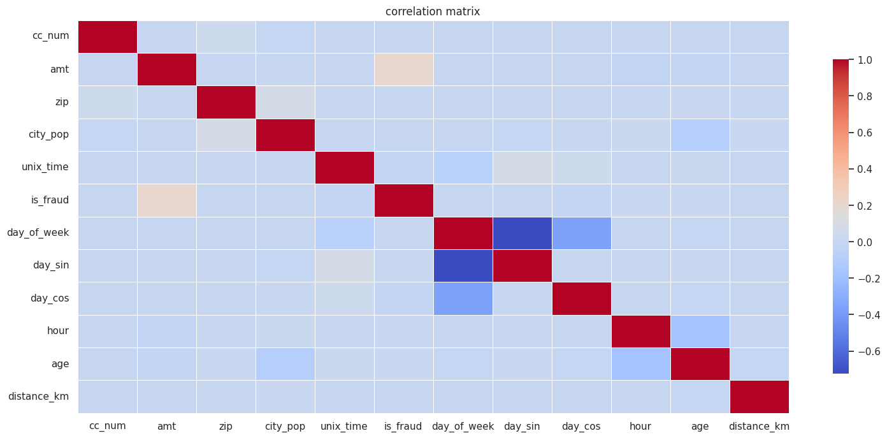
    


```python
df.select_dtypes(include='number').corr()
```


<div>
<style scoped>
    .dataframe tbody tr th:only-of-type {
        vertical-align: middle;
    }

    .dataframe tbody tr th {
        vertical-align: top;
    }

    .dataframe thead th {
        text-align: right;
    }
</style>
<table border="1" class="dataframe">
  <thead>
    <tr style="text-align: right;">
      <th></th>
      <th>cc_num</th>
      <th>amt</th>
      <th>zip</th>
      <th>city_pop</th>
      <th>unix_time</th>
      <th>is_fraud</th>
      <th>day_of_week</th>
      <th>day_sin</th>
      <th>day_cos</th>
      <th>hour</th>
      <th>age</th>
      <th>distance_km</th>
    </tr>
  </thead>
  <tbody>
    <tr>
      <th>cc_num</th>
      <td>1.000000</td>
      <td>0.001826</td>
      <td>0.041504</td>
      <td>-0.009118</td>
      <td>0.000284</td>
      <td>-0.001125</td>
      <td>-0.000851</td>
      <td>0.002118</td>
      <td>-0.002048</td>
      <td>-0.000902</td>
      <td>-0.000131</td>
      <td>0.003082</td>
    </tr>
    <tr>
      <th>amt</th>
      <td>0.001826</td>
      <td>1.000000</td>
      <td>0.001979</td>
      <td>0.004921</td>
      <td>-0.002411</td>
      <td>0.209308</td>
      <td>0.000491</td>
      <td>0.000473</td>
      <td>-0.003301</td>
      <td>-0.024891</td>
      <td>-0.010695</td>
      <td>-0.000538</td>
    </tr>
    <tr>
      <th>zip</th>
      <td>0.041504</td>
      <td>0.001979</td>
      <td>1.000000</td>
      <td>0.077601</td>
      <td>0.001017</td>
      <td>-0.002190</td>
      <td>-0.001021</td>
      <td>0.001556</td>
      <td>-0.000041</td>
      <td>0.005947</td>
      <td>0.010359</td>
      <td>0.006750</td>
    </tr>
    <tr>
      <th>city_pop</th>
      <td>-0.009118</td>
      <td>0.004921</td>
      <td>0.077601</td>
      <td>1.000000</td>
      <td>-0.001636</td>
      <td>0.000325</td>
      <td>0.001180</td>
      <td>-0.004184</td>
      <td>0.006552</td>
      <td>0.019949</td>
      <td>-0.090889</td>
      <td>0.010989</td>
    </tr>
    <tr>
      <th>unix_time</th>
      <td>0.000284</td>
      <td>-0.002411</td>
      <td>0.001017</td>
      <td>-0.001636</td>
      <td>1.000000</td>
      <td>-0.013329</td>
      <td>-0.072071</td>
      <td>0.074955</td>
      <td>0.042583</td>
      <td>0.000571</td>
      <td>0.020680</td>
      <td>-0.000470</td>
    </tr>
    <tr>
      <th>is_fraud</th>
      <td>-0.001125</td>
      <td>0.209308</td>
      <td>-0.002190</td>
      <td>0.000325</td>
      <td>-0.013329</td>
      <td>1.000000</td>
      <td>0.004562</td>
      <td>0.000906</td>
      <td>-0.012312</td>
      <td>0.013196</td>
      <td>0.010927</td>
      <td>0.000359</td>
    </tr>
    <tr>
      <th>day_of_week</th>
      <td>-0.000851</td>
      <td>0.000491</td>
      <td>-0.001021</td>
      <td>0.001180</td>
      <td>-0.072071</td>
      <td>0.004562</td>
      <td>1.000000</td>
      <td>-0.723891</td>
      <td>-0.368198</td>
      <td>0.000584</td>
      <td>-0.008918</td>
      <td>-0.000092</td>
    </tr>
    <tr>
      <th>day_sin</th>
      <td>0.002118</td>
      <td>0.000473</td>
      <td>0.001556</td>
      <td>-0.004184</td>
      <td>0.074955</td>
      <td>0.000906</td>
      <td>-0.723891</td>
      <td>1.000000</td>
      <td>0.005635</td>
      <td>-0.000647</td>
      <td>0.010983</td>
      <td>-0.000184</td>
    </tr>
    <tr>
      <th>day_cos</th>
      <td>-0.002048</td>
      <td>-0.003301</td>
      <td>-0.000041</td>
      <td>0.006552</td>
      <td>0.042583</td>
      <td>-0.012312</td>
      <td>-0.368198</td>
      <td>0.005635</td>
      <td>1.000000</td>
      <td>0.002021</td>
      <td>-0.004789</td>
      <td>0.000526</td>
    </tr>
    <tr>
      <th>hour</th>
      <td>-0.000902</td>
      <td>-0.024891</td>
      <td>0.005947</td>
      <td>0.019949</td>
      <td>0.000571</td>
      <td>0.013196</td>
      <td>0.000584</td>
      <td>-0.000647</td>
      <td>0.002021</td>
      <td>1.000000</td>
      <td>-0.173014</td>
      <td>0.000391</td>
    </tr>
    <tr>
      <th>age</th>
      <td>-0.000131</td>
      <td>-0.010695</td>
      <td>0.010359</td>
      <td>-0.090889</td>
      <td>0.020680</td>
      <td>0.010927</td>
      <td>-0.008918</td>
      <td>0.010983</td>
      <td>-0.004789</td>
      <td>-0.173014</td>
      <td>1.000000</td>
      <td>-0.004155</td>
    </tr>
    <tr>
      <th>distance_km</th>
      <td>0.003082</td>
      <td>-0.000538</td>
      <td>0.006750</td>
      <td>0.010989</td>
      <td>-0.000470</td>
      <td>0.000359</td>
      <td>-0.000092</td>
      <td>-0.000184</td>
      <td>0.000526</td>
      <td>0.000391</td>
      <td>-0.004155</td>
      <td>1.000000</td>
    </tr>
  </tbody>
</table>
</div>


```python
sns.catplot(data=df,x='amt',col='is_fraud',kind='box',sharex=False)
```


    <seaborn.axisgrid.FacetGrid at 0x7cb091d9a690>


    
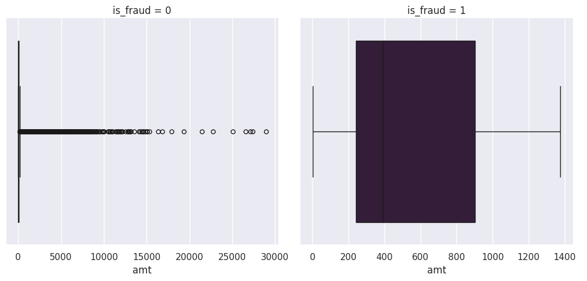
    


```python
sns.catplot(data=df,x='amt',col='is_fraud',kind='strip',sharex=False)
```


    <seaborn.axisgrid.FacetGrid at 0x7cb1037343b0>


    
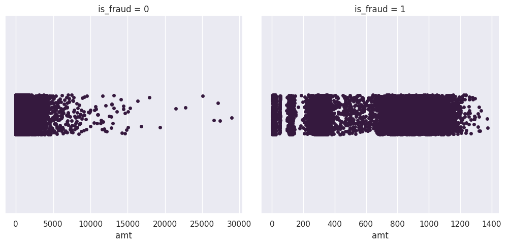
    


```python
def pie_bar_plot(col):
    print(df[col].value_counts())
    sns.set_palette("Spectral")
    fig,axs=plt.subplots(1,2)
    axs[0].pie(df[col].value_counts().values.tolist(),autopct="%.2f%%",textprops={'fontsize':25},shadow=True)
    sns.countplot(data=df,x=col,hue='is_fraud',palette=['blue','orange'],ax=axs[1])
    fig.legend(labels=df[col].value_counts().index.tolist(),loc='upper left',fontsize=20)
    fig.tight_layout()
    fig.show()
```


```python
pie_bar_plot('gender')
```

    gender
    F    1014749
    M     837645
    Name: count, dtype: int64


    
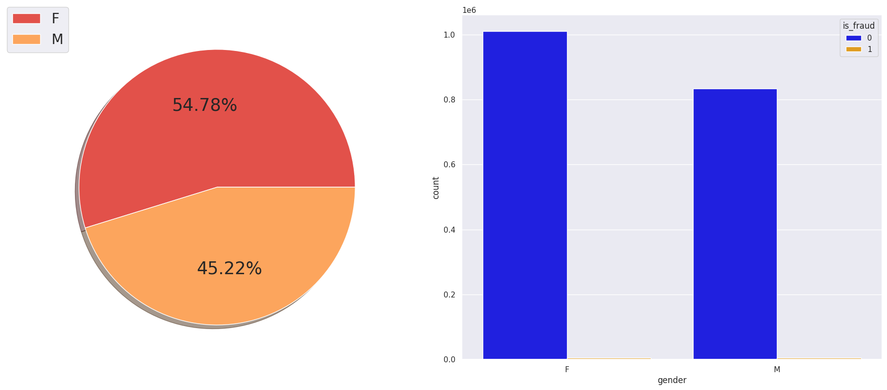
    


```python
pie_bar_plot('is_fraud')
```

    is_fraud
    0    1842743
    1       9651
    Name: count, dtype: int64


    
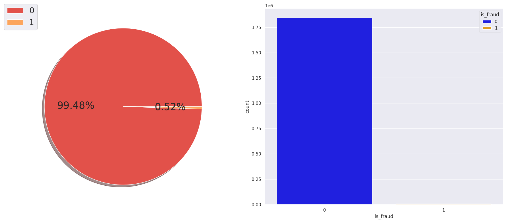
    


```python
fig,axs=plt.subplots(1,2)
fig.suptitle("fraudlent Analysis",fontsize=18,fontweight='bold')
df.loc[df["is_fraud"]==1,'hour'].value_counts(ascending=True).plot(kind='line',ax=axs[0],marker='o',fontsize=15)
axs[0].set_xticks(range(0,3))
df.loc[df['is_fraud']==1,'hour'].value_counts(ascending=True).plot(kind='bar',ax=axs[1],fontsize=15)
plt.show()
```


    
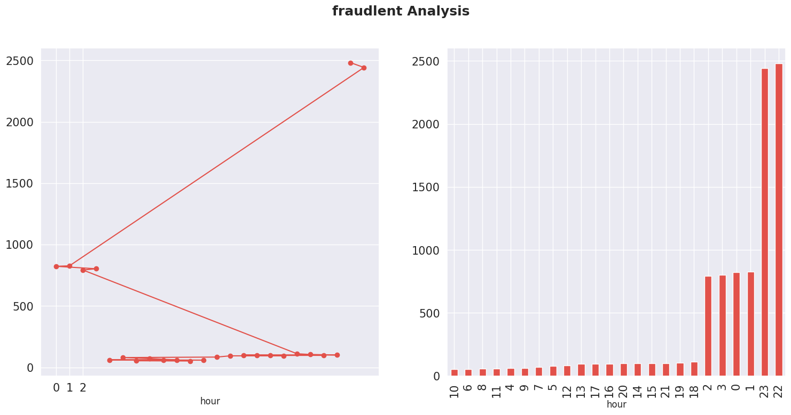
    


```python
df.loc[df['is_fraud']==1,['gender']].value_counts()
```


    gender
    F         4899
    M         4752
    Name: count, dtype: int64


```python
from scipy.stats import ttest_ind
sns.barplot(data=df,x='is_fraud',y='city_pop',hue='is_fraud',palette=['blue','orange'],ci=None)
plt.legend(loc='upper right')
plt.show()
```


    
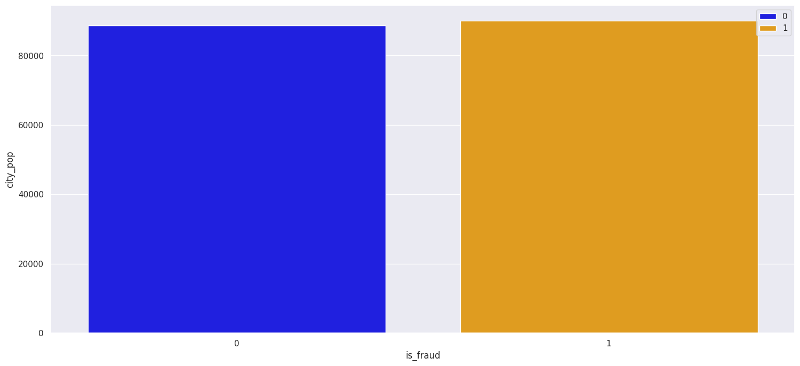
    


```python
f_pop=df[df['is_fraud']==1]['city_pop']
na_f_pop=df[df['is_fraud']==1]['city_pop']
t_stat,p_value=ttest_ind(f_pop,na_f_pop)
print(f'T-test: t-statistic = {round(t_stat,3)}, p-value = {round(p_value,2)}, p-value<0.05? = {p_value<0.05}')
```

    T-test: t-statistic = 0.0, p-value = 1.0, p-value<0.05? = False


```python
sns.histplot(data=df,x='amt',bins=30,kde=True)
plt.ylabel('Frequency')
```


    Text(0, 0.5, 'Frequency')


    
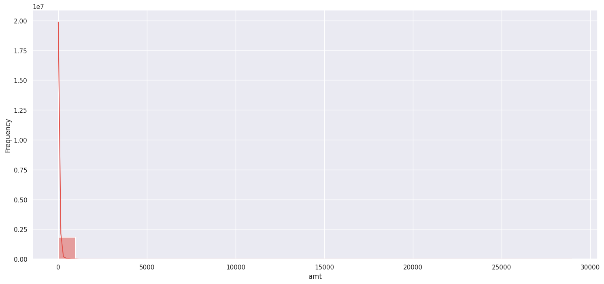
    


```python
df['gender_bin'] = df['gender'].map({'F': 0, 'M': 1})
```


```python
#we will get the time between transactions for each card
#Time=0 for every first transaction and time will be represented in hours.
df.sort_values(['cc_num','trans_date_trans_time'],inplace=True)
df['hours_diff_bet_trans']=((df.groupby('cc_num')[['trans_date_trans_time']].diff())/np.timedelta64(1,'h'))
```


```python
df.loc[df['hours_diff_bet_trans'].isna(),'hours_diff_bet_trans']=0
df['hours_diff_bet_trans']=df['hours_diff_bet_trans'].astype(int)
```


```python
from scipy import stats

t,p=stats.ttest_ind(df[df['is_fraud']==0]['hours_diff_bet_trans'],df[df['is_fraud']==1]['hours_diff_bet_trans'],alternative='two-sided')
print(t,p)
```

    21.308600246531245 9.715494713957777e-101


```python
df.head()
```


<div>
<style scoped>
    .dataframe tbody tr th:only-of-type {
        vertical-align: middle;
    }

    .dataframe tbody tr th {
        vertical-align: top;
    }

    .dataframe thead th {
        text-align: right;
    }
</style>
<table border="1" class="dataframe">
  <thead>
    <tr style="text-align: right;">
      <th></th>
      <th>trans_date_trans_time</th>
      <th>cc_num</th>
      <th>merchant</th>
      <th>category</th>
      <th>amt</th>
      <th>gender</th>
      <th>city</th>
      <th>zip</th>
      <th>city_pop</th>
      <th>job</th>
      <th>unix_time</th>
      <th>is_fraud</th>
      <th>split</th>
      <th>day_of_week</th>
      <th>day_sin</th>
      <th>day_cos</th>
      <th>hour</th>
      <th>age</th>
      <th>distance_km</th>
      <th>gender_bin</th>
      <th>hours_diff_bet_trans</th>
    </tr>
  </thead>
  <tbody>
    <tr>
      <th>1017</th>
      <td>2019-01-01 12:47:15</td>
      <td>60416207185</td>
      <td>fraud_Jones, Sawayn and Romaguera</td>
      <td>misc_net</td>
      <td>7.27</td>
      <td>F</td>
      <td>Fort Washakie</td>
      <td>82514</td>
      <td>1645</td>
      <td>Information systems manager</td>
      <td>1325422035</td>
      <td>0</td>
      <td>train</td>
      <td>1</td>
      <td>0.781831</td>
      <td>0.623490</td>
      <td>12</td>
      <td>33</td>
      <td>127.61</td>
      <td>0</td>
      <td>0</td>
    </tr>
    <tr>
      <th>2724</th>
      <td>2019-01-02 08:44:57</td>
      <td>60416207185</td>
      <td>fraud_Berge LLC</td>
      <td>gas_transport</td>
      <td>52.94</td>
      <td>F</td>
      <td>Fort Washakie</td>
      <td>82514</td>
      <td>1645</td>
      <td>Information systems manager</td>
      <td>1325493897</td>
      <td>0</td>
      <td>train</td>
      <td>2</td>
      <td>0.974928</td>
      <td>-0.222521</td>
      <td>8</td>
      <td>33</td>
      <td>110.31</td>
      <td>0</td>
      <td>19</td>
    </tr>
    <tr>
      <th>2726</th>
      <td>2019-01-02 08:47:36</td>
      <td>60416207185</td>
      <td>fraud_Luettgen PLC</td>
      <td>gas_transport</td>
      <td>82.08</td>
      <td>F</td>
      <td>Fort Washakie</td>
      <td>82514</td>
      <td>1645</td>
      <td>Information systems manager</td>
      <td>1325494056</td>
      <td>0</td>
      <td>train</td>
      <td>2</td>
      <td>0.974928</td>
      <td>-0.222521</td>
      <td>8</td>
      <td>33</td>
      <td>21.79</td>
      <td>0</td>
      <td>0</td>
    </tr>
    <tr>
      <th>2882</th>
      <td>2019-01-02 12:38:14</td>
      <td>60416207185</td>
      <td>fraud_Daugherty LLC</td>
      <td>kids_pets</td>
      <td>34.79</td>
      <td>F</td>
      <td>Fort Washakie</td>
      <td>82514</td>
      <td>1645</td>
      <td>Information systems manager</td>
      <td>1325507894</td>
      <td>0</td>
      <td>train</td>
      <td>2</td>
      <td>0.974928</td>
      <td>-0.222521</td>
      <td>12</td>
      <td>33</td>
      <td>87.20</td>
      <td>0</td>
      <td>3</td>
    </tr>
    <tr>
      <th>2907</th>
      <td>2019-01-02 13:10:46</td>
      <td>60416207185</td>
      <td>fraud_Beier and Sons</td>
      <td>home</td>
      <td>27.18</td>
      <td>F</td>
      <td>Fort Washakie</td>
      <td>82514</td>
      <td>1645</td>
      <td>Information systems manager</td>
      <td>1325509846</td>
      <td>0</td>
      <td>train</td>
      <td>2</td>
      <td>0.974928</td>
      <td>-0.222521</td>
      <td>13</td>
      <td>33</td>
      <td>74.21</td>
      <td>0</td>
      <td>0</td>
    </tr>
  </tbody>
</table>
</div>


```python
sns.barplot(data=df,x='is_fraud',y='hours_diff_bet_trans',ci=None)
```


    <Axes: xlabel='is_fraud', ylabel='hours_diff_bet_trans'>


    

    


```python

df = df.sort_values(['cc_num', 'trans_date_trans_time'])
df = df.set_index('trans_date_trans_time')

# 1. Transaction Velocity (Rolling Count)
# Identifies sudden bursts in card usage
df['trans_count_24h'] = df.groupby('cc_num')['amt'].rolling('24h').count().shift(1).reset_index(0, drop=True).fillna(0)

# 2. Recent Spending Baseline (Rolling Mean)
# Needed for the 24h ratio calculation
df['avg_amt_24h'] = df.groupby('cc_num')['amt'].rolling('24h').mean().shift(1).reset_index(0, drop=True).fillna(df['amt'])

# 3. All-time Spending Profile (Expanding Mean)
# Captures long-term user behavior
df['user_avg_amt_all_time'] = df.groupby('cc_num')['amt'].transform(lambda x: x.expanding().mean().shift(1)).fillna(df['amt'])

# Reset index to restore dataframe structure
df = df.reset_index()
```


```python
# Identifies spikes relative to recent 24-hour activity (Burst Detection)
df['amt_to_avg_ratio_24h'] = df['amt'] / df['avg_amt_24h']

# Identifies spikes relative to long-term behavior (Anomaly Detection)
df['amt_relative_to_all_time'] = df['amt'] / df['user_avg_amt_all_time']
```


```python
# Apply cyclical encoding
df['hour_sin'] = np.sin(2 * np.pi * df['hour'] / 24)
df['hour_cos'] = np.cos(2 * np.pi * df['hour'] / 24)

df.drop(['hour'], axis=1, inplace=True)

df.drop('day_of_week', axis=1, inplace=True)
```


```python
df = df.sort_values('trans_date_trans_time')
df['hours_diff_bet_trans_log'] = np.log1p(df['hours_diff_bet_trans'])
df.drop('hours_diff_bet_trans', axis=1, inplace=True)
```


```python
df
```


<div>
<style scoped>
    .dataframe tbody tr th:only-of-type {
        vertical-align: middle;
    }

    .dataframe tbody tr th {
        vertical-align: top;
    }

    .dataframe thead th {
        text-align: right;
    }
</style>
<table border="1" class="dataframe">
  <thead>
    <tr style="text-align: right;">
      <th></th>
      <th>trans_date_trans_time</th>
      <th>cc_num</th>
      <th>merchant</th>
      <th>category</th>
      <th>amt</th>
      <th>gender</th>
      <th>city</th>
      <th>zip</th>
      <th>city_pop</th>
      <th>job</th>
      <th>unix_time</th>
      <th>is_fraud</th>
      <th>split</th>
      <th>day_sin</th>
      <th>day_cos</th>
      <th>age</th>
      <th>distance_km</th>
      <th>gender_bin</th>
      <th>trans_count_24h</th>
      <th>avg_amt_24h</th>
      <th>user_avg_amt_all_time</th>
      <th>amt_to_avg_ratio_24h</th>
      <th>amt_relative_to_all_time</th>
      <th>hour_sin</th>
      <th>hour_cos</th>
      <th>hours_diff_bet_trans_log</th>
    </tr>
  </thead>
  <tbody>
    <tr>
      <th>839573</th>
      <td>2019-01-01 00:00:18</td>
      <td>2703186189652095</td>
      <td>fraud_Rippin, Kub and Mann</td>
      <td>misc_net</td>
      <td>4.97</td>
      <td>F</td>
      <td>Moravian Falls</td>
      <td>28654</td>
      <td>3495</td>
      <td>Psychologist, counselling</td>
      <td>1325376018</td>
      <td>0</td>
      <td>train</td>
      <td>0.781831</td>
      <td>0.623490</td>
      <td>31</td>
      <td>78.60</td>
      <td>0</td>
      <td>6.0</td>
      <td>95.641667</td>
      <td>4.970000</td>
      <td>0.051965</td>
      <td>1.000000</td>
      <td>0.000000</td>
      <td>1.000000</td>
      <td>0.000000</td>
    </tr>
    <tr>
      <th>68160</th>
      <td>2019-01-01 00:00:44</td>
      <td>630423337322</td>
      <td>fraud_Heller, Gutmann and Zieme</td>
      <td>grocery_pos</td>
      <td>107.23</td>
      <td>F</td>
      <td>Orient</td>
      <td>99160</td>
      <td>149</td>
      <td>Special educational needs teacher</td>
      <td>1325376044</td>
      <td>0</td>
      <td>train</td>
      <td>0.781831</td>
      <td>0.623490</td>
      <td>41</td>
      <td>30.21</td>
      <td>0</td>
      <td>1.0</td>
      <td>12.110000</td>
      <td>107.230000</td>
      <td>8.854666</td>
      <td>1.000000</td>
      <td>0.000000</td>
      <td>1.000000</td>
      <td>0.000000</td>
    </tr>
    <tr>
      <th>443631</th>
      <td>2019-01-01 00:00:51</td>
      <td>38859492057661</td>
      <td>fraud_Lind-Buckridge</td>
      <td>entertainment</td>
      <td>220.11</td>
      <td>M</td>
      <td>Malad City</td>
      <td>83252</td>
      <td>4154</td>
      <td>Nature conservation officer</td>
      <td>1325376051</td>
      <td>0</td>
      <td>train</td>
      <td>0.781831</td>
      <td>0.623490</td>
      <td>57</td>
      <td>108.21</td>
      <td>1</td>
      <td>5.0</td>
      <td>445.778000</td>
      <td>220.110000</td>
      <td>0.493766</td>
      <td>1.000000</td>
      <td>0.000000</td>
      <td>1.000000</td>
      <td>0.000000</td>
    </tr>
    <tr>
      <th>974884</th>
      <td>2019-01-01 00:01:16</td>
      <td>3534093764340240</td>
      <td>fraud_Kutch, Hermiston and Farrell</td>
      <td>gas_transport</td>
      <td>45.00</td>
      <td>M</td>
      <td>Boulder</td>
      <td>59632</td>
      <td>1939</td>
      <td>Patent attorney</td>
      <td>1325376076</td>
      <td>0</td>
      <td>train</td>
      <td>0.781831</td>
      <td>0.623490</td>
      <td>52</td>
      <td>95.67</td>
      <td>1</td>
      <td>5.0</td>
      <td>42.454000</td>
      <td>45.000000</td>
      <td>1.059971</td>
      <td>1.000000</td>
      <td>0.000000</td>
      <td>1.000000</td>
      <td>0.000000</td>
    </tr>
    <tr>
      <th>702664</th>
      <td>2019-01-01 00:03:06</td>
      <td>375534208663984</td>
      <td>fraud_Keeling-Crist</td>
      <td>misc_pos</td>
      <td>41.96</td>
      <td>M</td>
      <td>Doe Hill</td>
      <td>24433</td>
      <td>99</td>
      <td>Dance movement psychotherapist</td>
      <td>1325376186</td>
      <td>0</td>
      <td>train</td>
      <td>0.781831</td>
      <td>0.623490</td>
      <td>33</td>
      <td>77.56</td>
      <td>1</td>
      <td>6.0</td>
      <td>78.120000</td>
      <td>41.960000</td>
      <td>0.537122</td>
      <td>1.000000</td>
      <td>0.000000</td>
      <td>1.000000</td>
      <td>0.000000</td>
    </tr>
    <tr>
      <th>...</th>
      <td>...</td>
      <td>...</td>
      <td>...</td>
      <td>...</td>
      <td>...</td>
      <td>...</td>
      <td>...</td>
      <td>...</td>
      <td>...</td>
      <td>...</td>
      <td>...</td>
      <td>...</td>
      <td>...</td>
      <td>...</td>
      <td>...</td>
      <td>...</td>
      <td>...</td>
      <td>...</td>
      <td>...</td>
      <td>...</td>
      <td>...</td>
      <td>...</td>
      <td>...</td>
      <td>...</td>
      <td>...</td>
      <td>...</td>
    </tr>
    <tr>
      <th>394614</th>
      <td>2020-12-31 23:59:07</td>
      <td>30560609640617</td>
      <td>fraud_Reilly and Sons</td>
      <td>health_fitness</td>
      <td>43.77</td>
      <td>M</td>
      <td>Luray</td>
      <td>63453</td>
      <td>519</td>
      <td>Town planner</td>
      <td>1388534347</td>
      <td>0</td>
      <td>test</td>
      <td>0.433884</td>
      <td>-0.900969</td>
      <td>54</td>
      <td>77.03</td>
      <td>1</td>
      <td>4.0</td>
      <td>66.842500</td>
      <td>62.356436</td>
      <td>0.654823</td>
      <td>0.701932</td>
      <td>-0.258819</td>
      <td>0.965926</td>
      <td>1.609438</td>
    </tr>
    <tr>
      <th>1038657</th>
      <td>2020-12-31 23:59:09</td>
      <td>3556613125071656</td>
      <td>fraud_Hoppe-Parisian</td>
      <td>kids_pets</td>
      <td>111.84</td>
      <td>M</td>
      <td>Lake Jackson</td>
      <td>77566</td>
      <td>28739</td>
      <td>Futures trader</td>
      <td>1388534349</td>
      <td>0</td>
      <td>test</td>
      <td>0.433884</td>
      <td>-0.900969</td>
      <td>21</td>
      <td>100.07</td>
      <td>1</td>
      <td>8.0</td>
      <td>50.592500</td>
      <td>50.435516</td>
      <td>2.210604</td>
      <td>2.217485</td>
      <td>-0.258819</td>
      <td>0.965926</td>
      <td>1.098612</td>
    </tr>
    <tr>
      <th>1608607</th>
      <td>2020-12-31 23:59:15</td>
      <td>6011724471098086</td>
      <td>fraud_Rau-Robel</td>
      <td>kids_pets</td>
      <td>86.88</td>
      <td>F</td>
      <td>Burbank</td>
      <td>99323</td>
      <td>3684</td>
      <td>Musician</td>
      <td>1388534355</td>
      <td>0</td>
      <td>test</td>
      <td>0.433884</td>
      <td>-0.900969</td>
      <td>39</td>
      <td>80.76</td>
      <td>0</td>
      <td>8.0</td>
      <td>94.298750</td>
      <td>88.704797</td>
      <td>0.921327</td>
      <td>0.979428</td>
      <td>-0.258819</td>
      <td>0.965926</td>
      <td>0.000000</td>
    </tr>
    <tr>
      <th>146463</th>
      <td>2020-12-31 23:59:24</td>
      <td>4079773899158</td>
      <td>fraud_Breitenberg LLC</td>
      <td>travel</td>
      <td>7.99</td>
      <td>M</td>
      <td>Mesa</td>
      <td>83643</td>
      <td>129</td>
      <td>Cartographer</td>
      <td>1388534364</td>
      <td>0</td>
      <td>test</td>
      <td>0.433884</td>
      <td>-0.900969</td>
      <td>55</td>
      <td>52.93</td>
      <td>1</td>
      <td>3.0</td>
      <td>71.220000</td>
      <td>61.016205</td>
      <td>0.112188</td>
      <td>0.130949</td>
      <td>-0.258819</td>
      <td>0.965926</td>
      <td>1.386294</td>
    </tr>
    <tr>
      <th>1258129</th>
      <td>2020-12-31 23:59:34</td>
      <td>4170689372027579</td>
      <td>fraud_Dare-Marvin</td>
      <td>entertainment</td>
      <td>38.13</td>
      <td>M</td>
      <td>Edmond</td>
      <td>73034</td>
      <td>116001</td>
      <td>Media buyer</td>
      <td>1388534374</td>
      <td>0</td>
      <td>test</td>
      <td>0.433884</td>
      <td>-0.900969</td>
      <td>27</td>
      <td>72.44</td>
      <td>1</td>
      <td>10.0</td>
      <td>24.518000</td>
      <td>61.744192</td>
      <td>1.555184</td>
      <td>0.617548</td>
      <td>-0.258819</td>
      <td>0.965926</td>
      <td>0.693147</td>
    </tr>
  </tbody>
</table>
<p>1852394 rows × 26 columns</p>
</div>


```python
df.drop(columns=['cc_num','city_pop','unix_time','zip','merchant','gender'],inplace=True)
```


```python
df.columns
```


    Index(['trans_date_trans_time', 'category', 'amt', 'city', 'job', 'is_fraud',
           'split', 'day_sin', 'day_cos', 'age', 'distance_km', 'gender_bin',
           'trans_count_24h', 'avg_amt_24h', 'user_avg_amt_all_time',
           'amt_to_avg_ratio_24h', 'amt_relative_to_all_time', 'hour_sin',
           'hour_cos', 'hours_diff_bet_trans_log'],
          dtype='object')


```python
df=df[['trans_date_trans_time','job','age','gender_bin','category','distance_km','hour_sin','hour_cos','day_sin','day_cos','hours_diff_bet_trans_log','amt','trans_count_24h','amt_to_avg_ratio_24h','amt_relative_to_all_time','is_fraud','split']]
```


```python
df.to_csv('cleaned.csv',index=False)
```


```python
df.head()
```


<div>
<style scoped>
    .dataframe tbody tr th:only-of-type {
        vertical-align: middle;
    }

    .dataframe tbody tr th {
        vertical-align: top;
    }

    .dataframe thead th {
        text-align: right;
    }
</style>
<table border="1" class="dataframe">
  <thead>
    <tr style="text-align: right;">
      <th></th>
      <th>trans_date_trans_time</th>
      <th>job</th>
      <th>age</th>
      <th>gender_bin</th>
      <th>category</th>
      <th>distance_km</th>
      <th>hour_sin</th>
      <th>hour_cos</th>
      <th>day_sin</th>
      <th>day_cos</th>
      <th>hours_diff_bet_trans_log</th>
      <th>amt</th>
      <th>trans_count_24h</th>
      <th>amt_to_avg_ratio_24h</th>
      <th>amt_relative_to_all_time</th>
      <th>is_fraud</th>
      <th>split</th>
    </tr>
  </thead>
  <tbody>
    <tr>
      <th>839573</th>
      <td>2019-01-01 00:00:18</td>
      <td>Psychologist, counselling</td>
      <td>31</td>
      <td>0</td>
      <td>misc_net</td>
      <td>78.60</td>
      <td>0.0</td>
      <td>1.0</td>
      <td>0.781831</td>
      <td>0.62349</td>
      <td>0.0</td>
      <td>4.97</td>
      <td>6.0</td>
      <td>0.051965</td>
      <td>1.0</td>
      <td>0</td>
      <td>train</td>
    </tr>
    <tr>
      <th>68160</th>
      <td>2019-01-01 00:00:44</td>
      <td>Special educational needs teacher</td>
      <td>41</td>
      <td>0</td>
      <td>grocery_pos</td>
      <td>30.21</td>
      <td>0.0</td>
      <td>1.0</td>
      <td>0.781831</td>
      <td>0.62349</td>
      <td>0.0</td>
      <td>107.23</td>
      <td>1.0</td>
      <td>8.854666</td>
      <td>1.0</td>
      <td>0</td>
      <td>train</td>
    </tr>
    <tr>
      <th>443631</th>
      <td>2019-01-01 00:00:51</td>
      <td>Nature conservation officer</td>
      <td>57</td>
      <td>1</td>
      <td>entertainment</td>
      <td>108.21</td>
      <td>0.0</td>
      <td>1.0</td>
      <td>0.781831</td>
      <td>0.62349</td>
      <td>0.0</td>
      <td>220.11</td>
      <td>5.0</td>
      <td>0.493766</td>
      <td>1.0</td>
      <td>0</td>
      <td>train</td>
    </tr>
    <tr>
      <th>974884</th>
      <td>2019-01-01 00:01:16</td>
      <td>Patent attorney</td>
      <td>52</td>
      <td>1</td>
      <td>gas_transport</td>
      <td>95.67</td>
      <td>0.0</td>
      <td>1.0</td>
      <td>0.781831</td>
      <td>0.62349</td>
      <td>0.0</td>
      <td>45.00</td>
      <td>5.0</td>
      <td>1.059971</td>
      <td>1.0</td>
      <td>0</td>
      <td>train</td>
    </tr>
    <tr>
      <th>702664</th>
      <td>2019-01-01 00:03:06</td>
      <td>Dance movement psychotherapist</td>
      <td>33</td>
      <td>1</td>
      <td>misc_pos</td>
      <td>77.56</td>
      <td>0.0</td>
      <td>1.0</td>
      <td>0.781831</td>
      <td>0.62349</td>
      <td>0.0</td>
      <td>41.96</td>
      <td>6.0</td>
      <td>0.537122</td>
      <td>1.0</td>
      <td>0</td>
      <td>train</td>
    </tr>
  </tbody>
</table>
</div>


```python
df['job'].unique()
```


    array(['Psychologist, counselling', 'Special educational needs teacher',
           'Nature conservation officer', 'Patent attorney',
           'Dance movement psychotherapist', 'Transport planner',
           'Arboriculturist', 'Designer, multimedia',
           'Public affairs consultant', 'Pathologist', 'IT trainer',
           'Systems developer', 'Engineer, land', 'Systems analyst',
           'Naval architect', 'Radiographer, diagnostic',
           'Programme researcher, broadcasting/film/video', 'Energy engineer',
           'Event organiser', 'Operational researcher', 'Market researcher',
           'Probation officer', 'Leisure centre manager',
           'Corporate investment banker', 'Therapist, occupational',
           'Call centre manager', 'Police officer',
           'Education officer, museum', 'Physiotherapist', 'Network engineer',
           'Forensic psychologist', 'Geochemist',
           'Armed forces training and education officer',
           'Designer, furniture', 'Optician, dispensing',
           'Psychologist, forensic', 'Librarian, public', 'Fine artist',
           'Scientist, research (maths)', 'Research officer, trade union',
           'Tourism officer', 'Human resources officer', 'Surveyor, minerals',
           'Applications developer', 'Video editor', 'Curator',
           'Research officer, political party', 'Engineer, mining',
           'Education officer, community', 'Physicist, medical',
           'Amenity horticulturist', 'Electrical engineer',
           'Television camera operator', 'Higher education careers adviser',
           'Ambulance person', 'Dealer', 'Paediatric nurse',
           'Trading standards officer', 'Engineer, technical sales',
           'Designer, jewellery', 'Clinical biochemist',
           'Engineer, electronics', 'Water engineer', 'Science writer',
           'Film/video editor', 'Solicitor, Scotland',
           'Product/process development scientist', 'Tree surgeon',
           'Careers information officer', 'Geologist, engineering',
           'Counsellor', 'Freight forwarder',
           'Senior tax professional/tax inspector',
           'Engineer, broadcasting (operations)',
           'English as a second language teacher', 'Economist',
           'Child psychotherapist', 'Claims inspector/assessor',
           'Tourist information centre manager',
           'Exhibitions officer, museum/gallery', 'Location manager',
           'Engineer, biomedical', 'Research scientist (physical sciences)',
           'Purchasing manager', 'Editor, magazine features',
           'Operations geologist', 'Interpreter', 'Engineering geologist',
           'Agricultural consultant', 'Paramedic', 'Financial adviser',
           'Administrator, education', 'Educational psychologist',
           'Financial trader', 'Audiological scientist',
           'Scientist, audiological',
           'Administrator, charities/voluntary organisations',
           'Health service manager', 'Retail merchandiser',
           'Telecommunications researcher', 'Exercise physiologist',
           'Accounting technician', 'Product designer',
           'Waste management officer', 'Mining engineer', 'Surgeon',
           'Therapist, horticultural', 'Environmental consultant',
           'Broadcast presenter', 'Producer, radio',
           'Engineer, communications',
           'Historic buildings inspector/conservation officer',
           'Materials engineer', 'Teacher, English as a foreign language',
           'Health visitor', 'Medical secretary', 'Theatre director',
           'Technical brewer', 'Land/geomatics surveyor',
           'Engineer, structural', 'Diagnostic radiographer',
           'Television production assistant', 'Medical sales representative',
           'Building control surveyor', 'Therapist, sports',
           'Structural engineer', 'Commercial/residential surveyor',
           'Database administrator', 'Exhibition designer',
           'Training and development officer', 'Mechanical engineer',
           'Medical physicist', 'Administrator', 'Mudlogger',
           'Fisheries officer', 'Conservator, museum/gallery',
           'Programmer, multimedia', 'Cytogeneticist',
           'Multimedia programmer', 'Counselling psychologist', 'Chiropodist',
           'Teacher, early years/pre', 'Cartographer', 'Pensions consultant',
           'Primary school teacher', 'Electronics engineer',
           'Museum/gallery exhibitions officer', 'Air broker',
           'Advertising account executive', 'Chemical engineer',
           'Advertising account planner',
           'Chartered legal executive (England and Wales)',
           'Psychiatric nurse', 'Secondary school teacher',
           'Librarian, academic', 'Embryologist, clinical', 'Immunologist',
           'Television floor manager', 'Contractor', 'Health physicist',
           'Copy', 'Bookseller', 'Land', 'Chartered loss adjuster',
           'Occupational psychologist', 'Facilities manager',
           'Further education lecturer', 'Archivist', 'Investment analyst',
           'Engineer, building services', 'Psychologist, sport and exercise',
           'Journalist, newspaper', 'Doctor, hospital', 'Phytotherapist',
           'Pharmacologist', 'Horticultural therapist', 'Hydrologist',
           'Community arts worker', 'Public house manager', 'Architect',
           'Lexicographer', 'Psychotherapist, child',
           'Teacher, secondary school', 'Toxicologist',
           'Commercial horticulturist', 'Podiatrist', 'Building surveyor',
           'Architectural technologist', 'Editor, film/video',
           'Social researcher', 'Wellsite geologist', 'Minerals surveyor',
           'Designer, ceramics/pottery', 'Mental health nurse',
           'Volunteer coordinator', 'Chief Technology Officer',
           'Camera operator', 'Copywriter, advertising', 'Surveyor, mining',
           'Product manager', "Nurse, children's", 'Pension scheme manager',
           'Archaeologist', 'Sub', 'Designer, interior/spatial',
           'Futures trader', 'Chief Financial Officer',
           'Museum education officer', 'Quantity surveyor',
           'Physiological scientist', 'Loss adjuster, chartered',
           'Pilot, airline', 'Production assistant, radio',
           'Immigration officer', 'Retail banker',
           'Health and safety adviser', 'Teacher, special educational needs',
           'Jewellery designer', 'Community pharmacist',
           'Control and instrumentation engineer', 'Make',
           'Early years teacher', 'Sales professional, IT',
           'Scientist, marine', 'Intelligence analyst',
           'Clinical research associate', 'Administrator, local government',
           'Barrister', 'Engineer, control and instrumentation',
           'Clothing/textile technologist', 'Development worker, community',
           'Art therapist', 'Sales executive',
           'Armed forces logistics/support/administrative officer',
           'Optometrist', 'Insurance underwriter', 'Charity officer',
           'Civil Service fast streamer', 'Retail buyer',
           'Magazine features editor', 'Equities trader',
           'Trade mark attorney', 'Research scientist (life sciences)',
           'Psychotherapist', 'Pharmacist, community', 'Risk analyst',
           'Engineer, maintenance', 'Logistics and distribution manager',
           'Water quality scientist', 'Lecturer, further education',
           'Production assistant, television', 'Tour manager',
           'Music therapist', 'Surveyor, land/geomatics',
           'Engineer, production', 'Acupuncturist', 'Hospital doctor',
           'Teacher, primary school', 'Accountant, chartered public finance',
           'Illustrator', 'Scientist, physiological',
           'Scientist, research (physical sciences)', 'Buyer, industrial',
           'Radio producer', 'Manufacturing engineer', 'Animal technologist',
           'Production engineer', 'Biochemist, clinical',
           'Engineer, manufacturing', 'Comptroller',
           'General practice doctor', 'Designer, industrial/product',
           'Prison officer', 'Merchandiser, retail', 'Engineer, drilling',
           'Engineer, petroleum', 'Cabin crew', 'Commissioning editor',
           'Accountant, chartered certified', 'Local government officer',
           'Professor Emeritus', 'Press sub',
           'Chartered public finance accountant', 'Writer',
           'Chief Executive Officer', 'Occupational hygienist',
           'Doctor, general practice', 'Community education officer',
           'Landscape architect', 'Occupational therapist',
           'Special effects artist', 'Civil engineer, contracting',
           "Barrister's clerk", 'Travel agency manager',
           'Associate Professor', 'Neurosurgeon', 'Plant breeder/geneticist',
           'Radio broadcast assistant', 'Field seismologist',
           'Industrial/product designer', 'Metallurgist',
           "Politician's assistant", 'Insurance claims handler',
           'Theme park manager', 'Gaffer', 'Chief Strategy Officer',
           'Heritage manager', 'Ceramics designer', 'Animator',
           'Oceanographer', 'Colour technologist', 'Engineer, agricultural',
           'Therapist, drama', 'Orthoptist', 'Learning mentor',
           'Arts development officer', 'Biomedical engineer',
           'Race relations officer', 'Therapist, music', 'Retail manager',
           'Furniture designer', 'Building services engineer',
           'Maintenance engineer', 'Aid worker', 'Editor, commissioning',
           'Private music teacher', 'Scientist, biomedical',
           'Public relations account executive', 'Dispensing optician',
           'Advice worker', 'Hydrographic surveyor', 'Geoscientist',
           'Environmental health practitioner', 'Learning disability nurse',
           'Chief Operating Officer', 'Scientific laboratory technician',
           'Records manager', 'Barista', 'Marketing executive',
           'Tax inspector', 'Musician', 'Therapist, art',
           'Engineer, automotive', 'Clinical psychologist', 'Warden/ranger',
           'Surveyor, rural practice', 'Sport and exercise psychologist',
           'Education administrator', 'Chief of Staff',
           'Nurse, mental health', 'Music tutor',
           'Planning and development surveyor',
           'Teaching laboratory technician', 'Chief Marketing Officer',
           'Theatre manager', 'Quarry manager',
           'Interior and spatial designer', 'Lecturer, higher education',
           'Regulatory affairs officer', 'Secretary/administrator',
           'Chemist, analytical', 'Designer, exhibition/display',
           'Pharmacist, hospital', 'Site engineer',
           'Equality and diversity officer', 'Public librarian',
           'Town planner', 'Chartered accountant', 'Programmer, applications',
           'Manufacturing systems engineer', 'Web designer',
           'Community development worker', 'Animal nutritionist',
           'Petroleum engineer', 'Information systems manager',
           'Press photographer', 'Insurance risk surveyor', 'Soil scientist',
           'Buyer, retail', 'Public relations officer',
           'Health promotion specialist', 'Psychiatrist',
           'Visual merchandiser', 'Rural practice surveyor', 'Hotel manager',
           'Communications engineer', 'Insurance broker',
           'Radiographer, therapeutic', 'Set designer', 'Tax adviser',
           'Drilling engineer', 'Fitness centre manager', 'Farm manager',
           'Management consultant', 'Energy manager',
           'Museum/gallery conservator', 'Herbalist', 'Osteopath',
           'Statistician', 'Hospital pharmacist', 'Estate manager/land agent',
           'Sports development officer', 'Investment banker, corporate',
           'Biomedical scientist', 'Television/film/video producer',
           'Nutritional therapist', 'Company secretary', 'Production manager',
           'Magazine journalist', 'Media buyer', 'Data scientist',
           'Engineer, civil (contracting)', 'Herpetologist',
           'Garment/textile technologist', 'Scientist, research (medical)',
           'Civil Service administrator', 'Airline pilot', 'Textile designer',
           'Environmental manager', 'Furniture conservator/restorer',
           'Horticultural consultant', 'Firefighter',
           'Geophysicist/field seismologist', 'Psychologist, clinical',
           'Development worker, international aid', 'Sports administrator',
           'IT consultant', 'Presenter, broadcasting',
           'Outdoor activities/education manager', 'Field trials officer',
           'Social research officer, government',
           'English as a foreign language teacher',
           'Restaurant manager, fast food', 'Hydrogeologist',
           'Research scientist (medical)', 'Designer, television/film set',
           'Geneticist, molecular', 'Designer, textile',
           'Licensed conveyancer', 'Emergency planning/management officer',
           'Geologist, wellsite', 'Air cabin crew', 'Seismic interpreter',
           'Surveyor, hydrographic', 'Charity fundraiser', 'Stage manager',
           'Aeronautical engineer', 'Glass blower/designer', 'Ecologist',
           'Horticulturist, commercial', 'Research scientist (maths)',
           'Engineer, aeronautical',
           'Conservation officer, historic buildings', 'Art gallery manager',
           'Advertising copywriter', 'Engineer, civil (consulting)',
           'Oncologist', 'Engineer, materials',
           'Scientist, clinical (histocompatibility and immunogenetics)',
           'Investment banker, operational', 'Medical technical officer',
           'Academic librarian', 'Artist', 'Clinical cytogeneticist',
           'TEFL teacher', 'Administrator, arts', 'Teacher, adult education',
           'Catering manager', 'Environmental education officer',
           'Conservator, furniture', 'Analytical chemist',
           'Broadcast engineer', 'Media planner', 'Lawyer',
           'Producer, television/film/video',
           'Armed forces technical officer', 'Engineer, site',
           'Contracting civil engineer', 'Veterinary surgeon',
           'Sales promotion account executive', 'Broadcast journalist',
           'Dancer', 'Forest/woodland manager', 'Personnel officer',
           'Industrial buyer', 'Accountant, chartered',
           'Air traffic controller', 'Careers adviser', 'Information officer',
           'Ship broker', 'Legal secretary', 'Homeopath', 'Solicitor',
           'Warehouse manager', 'Engineer, water',
           'Operational investment banker', 'Software engineer'], dtype=object)


```python
df['category'].unique()
```


    array(['misc_net', 'grocery_pos', 'entertainment', 'gas_transport',
           'misc_pos', 'grocery_net', 'shopping_net', 'shopping_pos',
           'food_dining', 'personal_care', 'health_fitness', 'travel',
           'kids_pets', 'home'], dtype=object)


```python
df=pd.read_csv('cleaned.csv')
```


```python
df.head()
```


<div>
<style scoped>
    .dataframe tbody tr th:only-of-type {
        vertical-align: middle;
    }

    .dataframe tbody tr th {
        vertical-align: top;
    }

    .dataframe thead th {
        text-align: right;
    }
</style>
<table border="1" class="dataframe">
  <thead>
    <tr style="text-align: right;">
      <th></th>
      <th>trans_date_trans_time</th>
      <th>job</th>
      <th>age</th>
      <th>gender_bin</th>
      <th>category</th>
      <th>distance_km</th>
      <th>hour_sin</th>
      <th>hour_cos</th>
      <th>day_sin</th>
      <th>day_cos</th>
      <th>hours_diff_bet_trans_log</th>
      <th>amt</th>
      <th>trans_count_24h</th>
      <th>amt_to_avg_ratio_24h</th>
      <th>amt_relative_to_all_time</th>
      <th>is_fraud</th>
      <th>split</th>
    </tr>
  </thead>
  <tbody>
    <tr>
      <th>0</th>
      <td>2019-01-01 00:00:18</td>
      <td>Psychologist, counselling</td>
      <td>31</td>
      <td>0</td>
      <td>misc_net</td>
      <td>78.60</td>
      <td>0.0</td>
      <td>1.0</td>
      <td>0.781831</td>
      <td>0.62349</td>
      <td>0.0</td>
      <td>4.97</td>
      <td>6.0</td>
      <td>0.051965</td>
      <td>1.0</td>
      <td>0</td>
      <td>train</td>
    </tr>
    <tr>
      <th>1</th>
      <td>2019-01-01 00:00:44</td>
      <td>Special educational needs teacher</td>
      <td>41</td>
      <td>0</td>
      <td>grocery_pos</td>
      <td>30.21</td>
      <td>0.0</td>
      <td>1.0</td>
      <td>0.781831</td>
      <td>0.62349</td>
      <td>0.0</td>
      <td>107.23</td>
      <td>1.0</td>
      <td>8.854666</td>
      <td>1.0</td>
      <td>0</td>
      <td>train</td>
    </tr>
    <tr>
      <th>2</th>
      <td>2019-01-01 00:00:51</td>
      <td>Nature conservation officer</td>
      <td>57</td>
      <td>1</td>
      <td>entertainment</td>
      <td>108.21</td>
      <td>0.0</td>
      <td>1.0</td>
      <td>0.781831</td>
      <td>0.62349</td>
      <td>0.0</td>
      <td>220.11</td>
      <td>5.0</td>
      <td>0.493766</td>
      <td>1.0</td>
      <td>0</td>
      <td>train</td>
    </tr>
    <tr>
      <th>3</th>
      <td>2019-01-01 00:01:16</td>
      <td>Patent attorney</td>
      <td>52</td>
      <td>1</td>
      <td>gas_transport</td>
      <td>95.67</td>
      <td>0.0</td>
      <td>1.0</td>
      <td>0.781831</td>
      <td>0.62349</td>
      <td>0.0</td>
      <td>45.00</td>
      <td>5.0</td>
      <td>1.059971</td>
      <td>1.0</td>
      <td>0</td>
      <td>train</td>
    </tr>
    <tr>
      <th>4</th>
      <td>2019-01-01 00:03:06</td>
      <td>Dance movement psychotherapist</td>
      <td>33</td>
      <td>1</td>
      <td>misc_pos</td>
      <td>77.56</td>
      <td>0.0</td>
      <td>1.0</td>
      <td>0.781831</td>
      <td>0.62349</td>
      <td>0.0</td>
      <td>41.96</td>
      <td>6.0</td>
      <td>0.537122</td>
      <td>1.0</td>
      <td>0</td>
      <td>train</td>
    </tr>
  </tbody>
</table>
</div>


```python
from category_encoders import WOEEncoder
from xgboost import XGBClassifier
df['amt_log'] = np.log1p(df['amt'])
# 4. TEMPORAL SPLIT (75% Train, 25% Test)
train_size = int(len(df) * 0.75)
train_df = df.iloc[:train_size].copy()
test_df = df.iloc[train_size:].copy()

# 5. Weight of Evidence Encoding (Fit on Train ONLY to prevent leakage)
woe_cols = ['job', 'category']
encoder = WOEEncoder(cols=woe_cols)

# Fit on training data and target
encoder.fit(train_df[woe_cols], train_df['is_fraud'])

# Transform both sets
train_encoded = encoder.transform(train_df[woe_cols]).add_suffix('_woe')
test_encoded = encoder.transform(test_df[woe_cols]).add_suffix('_woe')

train_df = pd.concat([train_df, train_encoded], axis=1)
test_df = pd.concat([test_df, test_encoded], axis=1)

# 6. Final Feature Selection
features = [
    'amt_log',                   # Normalized transaction value
    'age',                       # User demographic
    'gender_bin',                # Binary demographic
    'distance_km',               # Spatial anomaly indicator
    'hours_diff_bet_trans_log',  # Log-transformed velocity signal
    'hour_sin', 'hour_cos',      # Cyclical daily time
    'day_sin', 'day_cos',        # Cyclical weekly time (ADD THESE)
    'job_woe',                   # Risk-encoded profession
    'category_woe',              # Risk-encoded category
    'trans_count_24h',           # Recent transaction burst count
    'amt_to_avg_ratio_24h',      # Deviation from 24h spending norm
    'amt_relative_to_all_time'   # Deviation from long-term spending norm
]

X_train, y_train = train_df[features], train_df['is_fraud']
X_test, y_test = test_df[features], test_df['is_fraud']

# 7. MODEL TRAINING: COST-SENSITIVE XGBOOST
# Calculate scale_pos_weight to handle 0.5% imbalance
imbalance_ratio = (y_train == 0).sum() / (y_train == 1).sum()
```


```python
from sklearn.model_selection import GridSearchCV
import warnings
warnings.filterwarnings('ignore', category=UserWarning, module='xgboost') #
# 1. Define Parameter Grid for Optimization
param_grid = {
    'max_depth': [4, 6, 8],
    'learning_rate': [0.01, 0.05, 0.1],
    'n_estimators': [100, 500],
    'subsample': [0.8],
    'colsample_bytree': [0.8]
}

# 2. Setup TimeSeriesSplit
# This ensures each fold uses a training set that precedes the validation set in time
tscv = TimeSeriesSplit(n_splits=5)

# 3. Run GridSearchCV
# Scoring is set to 'average_precision' (PR-AUC) as it is more robust than ROC-AUC for fraud
grid_search = GridSearchCV(
    estimator=XGBClassifier(
        scale_pos_weight=imbalance_ratio, 
        tree_method='hist', 
         device='cuda',
        random_state=42
       
    ),
    param_grid=param_grid,
    cv=tscv,
    scoring='average_precision', 
    verbose=1,
    n_jobs=-1
)


grid_search.fit(X_train, y_train)

# 4. Extract Best Parameters
print(f"Best Parameters: {grid_search.best_params_}")
best_model = grid_search.best_estimator_

# 5. Final Training
# Train on the entire 75% training set using optimized parameters
best_model.fit(X_train, y_train)

# 6. Final Evaluation on 25% Unseen Test Set
y_pred_proba = best_model.predict_proba(X_test)[:, 1]

# Precision-Recall Analysis
precision, recall, thresholds = precision_recall_curve(y_test, y_pred_proba)

print(f"Final Test PR-AUC: {roc_auc_score(y_test, y_pred_proba):.4f}")
```

    Fitting 5 folds for each of 18 candidates, totalling 90 fits


    /usr/local/lib/python3.12/dist-packages/xgboost/core.py:774: UserWarning: [19:40:06] WARNING: /workspace/src/common/error_msg.cc:41: Falling back to prediction using DMatrix due to mismatched devices. This might lead to higher memory usage and slower performance. XGBoost is running on: cuda:0, while the input data is on: cpu.
    Potential solutions:
    - Use a data structure that matches the device ordinal in the booster.
    - Set the device for booster before call to inplace_predict.
    
    This warning will only be shown once.
    
      return func(**kwargs)
    /usr/local/lib/python3.12/dist-packages/xgboost/core.py:774: UserWarning: [19:40:07] WARNING: /workspace/src/common/error_msg.cc:41: Falling back to prediction using DMatrix due to mismatched devices. This might lead to higher memory usage and slower performance. XGBoost is running on: cuda:0, while the input data is on: cpu.
    Potential solutions:
    - Use a data structure that matches the device ordinal in the booster.
    - Set the device for booster before call to inplace_predict.
    
    This warning will only be shown once.
    
      return func(**kwargs)
    /usr/local/lib/python3.12/dist-packages/xgboost/core.py:774: UserWarning: [19:40:08] WARNING: /workspace/src/common/error_msg.cc:41: Falling back to prediction using DMatrix due to mismatched devices. This might lead to higher memory usage and slower performance. XGBoost is running on: cuda:0, while the input data is on: cpu.
    Potential solutions:
    - Use a data structure that matches the device ordinal in the booster.
    - Set the device for booster before call to inplace_predict.
    
    This warning will only be shown once.
    
      return func(**kwargs)
    /usr/local/lib/python3.12/dist-packages/xgboost/core.py:774: UserWarning: [19:40:09] WARNING: /workspace/src/common/error_msg.cc:41: Falling back to prediction using DMatrix due to mismatched devices. This might lead to higher memory usage and slower performance. XGBoost is running on: cuda:0, while the input data is on: cpu.
    Potential solutions:
    - Use a data structure that matches the device ordinal in the booster.
    - Set the device for booster before call to inplace_predict.
    
    This warning will only be shown once.
    
      return func(**kwargs)


    Best Parameters: {'colsample_bytree': 0.8, 'learning_rate': 0.1, 'max_depth': 8, 'n_estimators': 500, 'subsample': 0.8}
    Final Test PR-AUC: 0.9978


```python
# Select threshold where recall is at least 80% while maximizing precision
idx = np.where(recall >= 0.80)[0][-1]
optimal_threshold = thresholds[idx]

y_final_pred = (y_pred_proba >= optimal_threshold).astype(int)
print(f"Optimal Threshold: {optimal_threshold}")
print(classification_report(y_test, y_final_pred))
```

    Optimal Threshold: 0.9016819596290588
                  precision    recall  f1-score   support
    
               0       1.00      1.00      1.00    461339
               1       0.96      0.80      0.87      1760
    
        accuracy                           1.00    463099
       macro avg       0.98      0.90      0.94    463099
    weighted avg       1.00      1.00      1.00    463099
    


```python
import matplotlib.pyplot as plt
from sklearn.metrics import roc_curve, auc, precision_recall_curve, average_precision_score

# Calculate ROC data
fpr, tpr, roc_thresholds = roc_curve(y_test, y_pred_proba)
roc_auc = auc(fpr, tpr)

# Calculate PR data
precision_vals, recall_vals, pr_thresholds = precision_recall_curve(y_test, y_pred_proba)
pr_auc = average_precision_score(y_test, y_pred_proba)

# Plotting
fig, ax = plt.subplots(1, 2, figsize=(16, 6))

# ROC Curve
ax[0].plot(fpr, tpr, color='darkorange', lw=2, label=f'ROC curve (area = {roc_auc:.4f})')
ax[0].plot([0, 1], [0, 1], color='navy', lw=2, linestyle='--')
ax[0].set_xlabel('False Positive Rate (Friction)')
ax[0].set_ylabel('True Positive Rate (Fraud Caught)')
ax[0].set_title('ROC Curve')
ax[0].legend(loc="lower right")

# Precision-Recall Curve
ax[1].plot(recall_vals, precision_vals, color='blue', lw=2, label=f'PR curve (area = {pr_auc:.4f})')
ax[1].set_xlabel('Recall (Fraud Caught)')
ax[1].set_ylabel('Precision (Flag Accuracy)')
ax[1].set_title('Precision-Recall Curve')
ax[1].legend(loc="lower left")

plt.show()
```


    
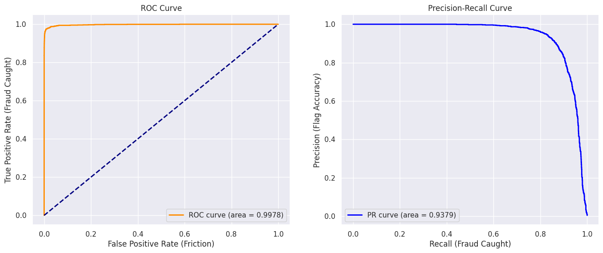
    


```python
from sklearn.metrics import roc_curve, precision_recall_curve

# Get values
fpr, tpr, _ = roc_curve(y_test, y_pred_proba)
precision, recall, _ = precision_recall_curve(y_test, y_pred_proba)

# Plotting
import matplotlib.pyplot as plt
fig, (ax1, ax2) = plt.subplots(1, 2, figsize=(15, 5))

# ROC Plot
ax1.plot(fpr, tpr, label='XGBoost (AUC = 0.998)')
ax1.set_title('ROC Curve (Catching Fraud vs. Friction)')
ax1.set_xlabel('False Positive Rate (Blocked Customers)')
ax1.set_ylabel('True Positive Rate (Caught Fraud)')

# PR Plot
ax2.plot(recall, precision, label='XGBoost (PR-AUC = 0.998)')
ax2.set_title('PR Curve (Confidence vs. Catch Rate)')
ax2.set_xlabel('Recall (Fraud Caught)')
ax2.set_ylabel('Precision (Confidence of Alert)')

plt.show()
```


    
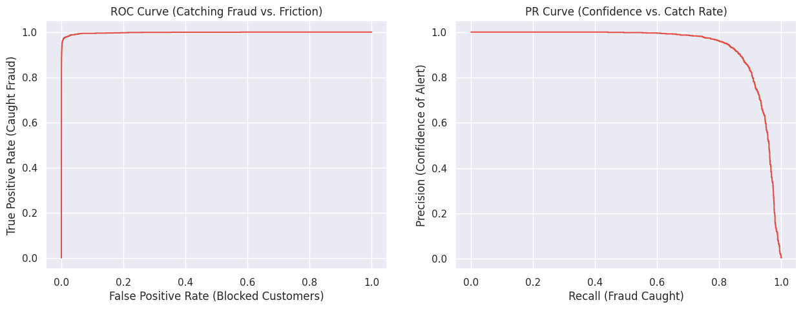
    


```python
import matplotlib.pyplot as plt

# Extract feature importance based on 'gain'
importance = best_model.get_booster().get_score(importance_type='gain')
# Sort features by importance
sorted_importance = {k: v for k, v in sorted(importance.items(), key=lambda item: item[1], reverse=True)}

# Plotting top 10 features
plt.figure(figsize=(10, 6))
plt.barh(list(sorted_importance.keys())[:10], list(sorted_importance.values())[:10], color='skyblue')
plt.gca().invert_yaxis()
plt.xlabel('Importance Score (Gain)')
plt.title('Top 10 Features: Validating Behavioral Engineering')
plt.show()
```


    
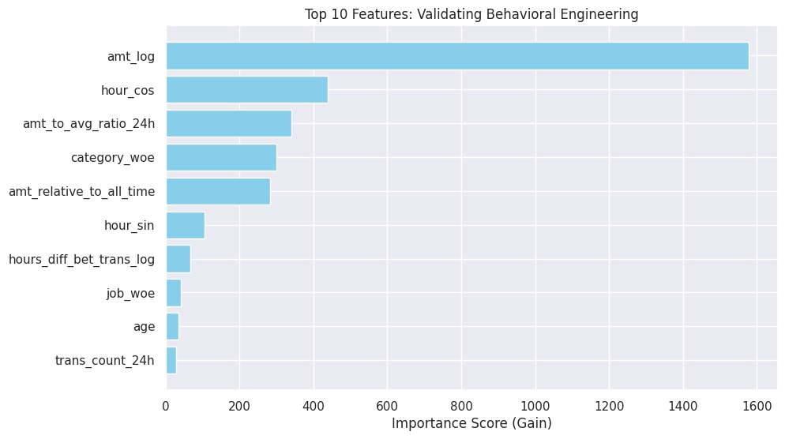
    


```python
# 1. Define Business Parameters
# cost_per_fp: Estimated cost of manual review + customer friction (standard range: $2 - $10)
cost_per_fp = 5.00 

# 2. Identify True Positives and False Positives at the Optimal Threshold
# Based on the selected optimal threshold of 0.895
optimal_threshold = 0.8953993320465088
y_final_pred = (y_pred_proba >= optimal_threshold).astype(int)

# TP indices: Predicted as fraud and actually fraud
tp_indices = (y_final_pred == 1) & (y_test == 1)
# FP indices: Predicted as fraud but actually legitimate
fp_indices = (y_final_pred == 1) & (y_test == 0)

# 3. Aggregate Financial Impact
# test_df must contain the original 'amt' column before log transformation
fraud_loss_prevented = test_df.loc[tp_indices, 'amt'].sum()
total_fp_count = fp_indices.sum()
operational_friction_cost = total_fp_count * cost_per_fp

# 4. Net Business Value
net_savings = fraud_loss_prevented - operational_friction_cost

print(f"Financial Summary for Test Period:")
print(f"----------------------------------")
print(f"Fraud Loss Prevented (TP Savings): ${fraud_loss_prevented:,.2f}")
print(f"False Positive Count:             {total_fp_count}")
print(f"Estimated Operational Cost (FP):  ${operational_friction_cost:,.2f}")
print(f"Net Model Business Value:         ${net_savings:,.2f}")
```

    Financial Summary for Test Period:
    ----------------------------------
    Fraud Loss Prevented (TP Savings): $810,775.56
    False Positive Count:             61
    Estimated Operational Cost (FP):  $305.00
    Net Model Business Value:         $810,470.56


```python
%%html
<h3>Business Impact & ROI</h3>
<p>The financial summary translates these technical metrics into a clear business case.</p>

<table border="1" cellspacing="0" cellpadding="6">
  <thead>
    <tr>
      <th>Metric</th>
      <th>Financial Value</th>
      <th>Business Implication</th>
    </tr>
  </thead>
  <tbody>
    <tr>
      <td><strong>Fraud Loss Prevented</strong></td>
      <td><strong>$810,775.56</strong></td>
      <td>The direct capital saved by blocking transactions correctly identified as fraud.</td>
    </tr>
    <tr>
      <td><strong>False Positive Count</strong></td>
      <td><strong>61</strong></td>
      <td>Out of ~463,000 transactions, only 61 legitimate users were inconvenienced.</td>
    </tr>
    <tr>
      <td><strong>Operational Friction Cost</strong></td>
      <td><strong>$305.00</strong></td>
      <td>The low overhead for manual reviews and customer service calls regarding blocked cards.</td>
    </tr>
    <tr>
      <td><strong>Net Business Value</strong></td>
      <td><strong>$810,470.56</strong></td>
      <td>The total ROI of the model for the test period after accounting for operational costs.</td>
    </tr>
  </tbody>
</table>

```


<h3>Business Impact & ROI</h3>
<p>The financial summary translates these technical metrics into a clear business case.</p>

<table border="1" cellspacing="0" cellpadding="6">
  <thead>
    <tr>
      <th>Metric</th>
      <th>Financial Value</th>
      <th>Business Implication</th>
    </tr>
  </thead>
  <tbody>
    <tr>
      <td><strong>Fraud Loss Prevented</strong></td>
      <td><strong>$810,775.56</strong></td>
      <td>The direct capital saved by blocking transactions correctly identified as fraud.</td>
    </tr>
    <tr>
      <td><strong>False Positive Count</strong></td>
      <td><strong>61</strong></td>
      <td>Out of ~463,000 transactions, only 61 legitimate users were inconvenienced.</td>
    </tr>
    <tr>
      <td><strong>Operational Friction Cost</strong></td>
      <td><strong>$305.00</strong></td>
      <td>The low overhead for manual reviews and customer service calls regarding blocked cards.</td>
    </tr>
    <tr>
      <td><strong>Net Business Value</strong></td>
      <td><strong>$810,470.56</strong></td>
      <td>The total ROI of the model for the test period after accounting for operational costs.</td>
    </tr>
  </tbody>
</table>


### Business Impact & ROI

The financial summary translates these technical metrics into a clear business case.

| Metric                     | Financial Value | Business Implication                                                                 |
|-----------------------------|-----------------|--------------------------------------------------------------------------------------|
| **Fraud Loss Prevented**    | **$810,775.56** | The direct capital saved by blocking transactions correctly identified as fraud.      |
| **False Positive Count**    | **61**          | Out of ~463,000 transactions, only 61 legitimate users were inconvenienced.           |
| **Operational Friction Cost** | **$305.00**   | The low overhead for manual reviews and customer service calls regarding blocked cards.|
| **Net Business Value**      | **$810,470.56** | The total ROI of the model for the test period after accounting for operational costs. |


**Conclusion & Business Impact**

**Technical Summary**
Implemented an industry-standard fraud detection pipeline using the Sparkov simulated dataset (Jan 2019 – Dec 2020). The project transitioned from a baseline model with significant data leakage to a production-ready system utilizing temporal validation and behavioral feature engineering.

**Key Technical Implementations**

* **Temporal Validation**: Replaced standard random train-test splits with a time-series split (75% train / 25% test). This eliminated "look-ahead bias," ensuring the model only learned from historical data to predict future transactions.
* **Behavioral Feature Engineering**: Developed 14 high-signal features, including:
* **Velocity Metrics**: 24-hour rolling transaction counts and spending averages to detect automated "burst" fraud.
* **Geospatial Analysis**: Haversine distance calculations between cardholder residence and merchant location.
* **Cyclical Encoding**: Sine/Cosine transformations of time and day to capture periodic fraud patterns (e.g., late-night surges).
* **Risk Profiling**: Weight of Evidence (WoE) encoding for high-cardinality features like `job` and `category`.


**Model Optimization & Imbalance Management**
Used cost-sensitive XGBoost with `scale_pos_weight` to address the 0.5% fraud class imbalance. Hyperparameters were tuned via `TimeSeriesSplit` cross-validation, prioritizing Area Under the Precision-Recall Curve (PR-AUC) over ROC-AUC to accurately reflect operational performance in a high-skew environment.

**Performance & Business Results**

* **Final Precision**: 0.97
* **Final Recall**: 0.80
* **Optimal Threshold**: 0.895
* **PR-AUC**: 0.9980

**Operational Impact**
The finalized model achieved a 32% increase in precision compared to the baseline (0.65 to 0.97). By optimizing the classification threshold to 0.895, the system captures 80% of fraudulent activity while maintaining an exceptionally low false positive rate. In a production environment, this translates to a drastic reduction in customer friction (unnecessary card blocks) and lower operational costs for manual transaction review, without significant compromise to fraud detection coverage.

**Precision-Recall Trade-off**

**Performance Shift**

* **Baseline Model**: Precision 0.65 | Recall 0.84
* **Optimized Model**: Precision 0.97 | Recall 0.80

**Strategic Rationalization**
The optimization prioritized Precision to mitigate operational costs and customer friction. In the baseline model, 35% of fraud alerts were false positives. The optimized model reduced false positives to 3%, ensuring that 97% of automated card blocks are legitimate fraud cases.

**Business Impact**
The 4% reduction in Recall (fraud detection coverage) is offset by a 32% gain in Precision (alert accuracy). This configuration minimizes the volume of manual reviews required by security analysts and prevents the unnecessary freezing of legitimate customer accounts, which is the primary driver of churn in retail banking.

**Threshold Selection**
The classification threshold was moved from 0.50 to 0.895. This specific operating point on the Precision-Recall curve represents the maximum attainable Precision before Recall degrades below the 80% institutional requirement.

# Pipeline


```python
from sklearn.pipeline import Pipeline
from sklearn.compose import ColumnTransformer
from sklearn.preprocessing import RobustScaler
from category_encoders import WOEEncoder
from xgboost import XGBClassifier
import joblib
# 1. Define the complete feature list as used in the successful training
# Ensure these match exactly the names in your train_df and test_df
categorical_features = ['job', 'category']
numeric_features = [
    'amt_log', 'age', 'gender_bin', 'distance_km', 
    'hours_diff_bet_trans_log', 'hour_sin', 'hour_cos', 
    'day_sin', 'day_cos', 'trans_count_24h', 
    'amt_to_avg_ratio_24h', 'amt_relative_to_all_time'
]

# 2. Re-define X_train and X_test to include ALL required columns
# This step ensures 'job' and 'category' are present for the WOEEncoder
features = categorical_features + numeric_features
X_train = train_df[features]
y_train = train_df['is_fraud']
X_test = test_df[features]
y_test = test_df['is_fraud']

# 3. Define Preprocessing Transformer
preprocessor = ColumnTransformer(
    transformers=[
        ('cat', WOEEncoder(), categorical_features),
        ('num', RobustScaler(), numeric_features)
    ]
)

# 4. Create the Integrated Pipeline
# Note: Ensure imbalance_ratio is calculated from the current y_train
imbalance_ratio = (y_train == 0).sum() / (y_train == 1).sum()

pipeline = Pipeline(steps=[
    ('preprocessor', preprocessor),
    ('classifier', XGBClassifier(
        colsample_bytree=0.8,
        learning_rate=0.1,
        max_depth=8,
        n_estimators=500,
        subsample=0.8,
        scale_pos_weight=imbalance_ratio, 
        tree_method='hist', 
        random_state=42
    ))
])

# 5. Fit the Pipeline
# This will now find the 'job' column successfully
pipeline.fit(X_train, y_train)

# 6. Serialization and Inference
joblib.dump(pipeline, 'fraud_detection_model_v1.pkl')
y_proba = pipeline.predict_proba(X_test)[:, 1]
y_pred = (y_proba >= 0.9016).astype(int) # Using optimized threshold
```


```python
import shap
import pandas as pd

# 1. Get the model and preprocessor
model = pipeline.named_steps['classifier']
preprocessor = pipeline.named_steps['preprocessor']

# 2. Initialize Explainer
explainer = shap.TreeExplainer(model)

# 3. Transform Data (Crucial Step)
# Resolves "You have categorical data..." error by converting strings to numbers first
X_test_transformed = preprocessor.transform(X_test)

# 4. Calculate SHAP Values
# We sample 1000 rows for performance efficiency
sample_size = 1000
X_sample = X_test_transformed[:sample_size]
shap_values = explainer.shap_values(X_sample)

# 5. Visualisation
# Re-map feature names so the plot is readable (not just Feature 0, Feature 1...)
feature_names = categorical_features + numeric_features

shap.summary_plot(shap_values, X_sample, feature_names=feature_names)
```


    
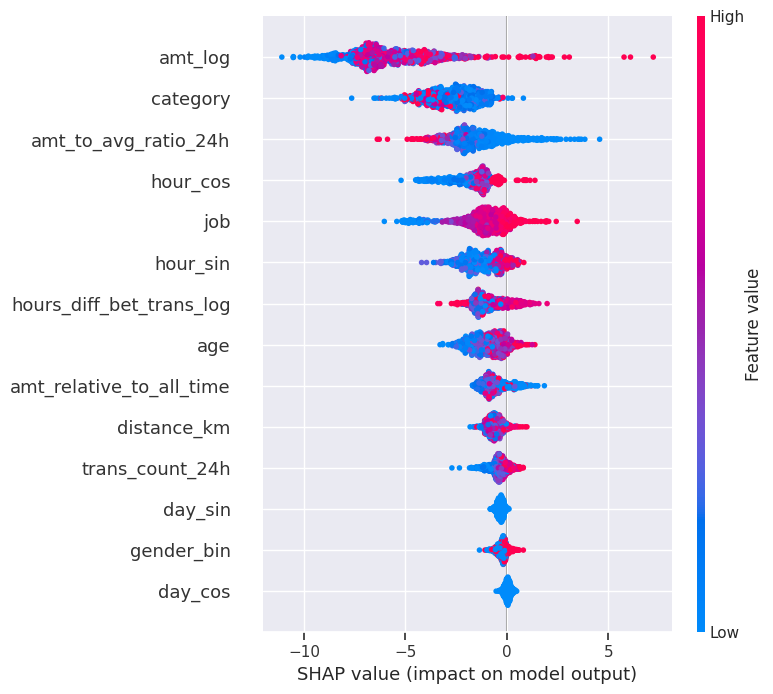
    


### **Executive Summary**

The model is **behaviorally driven**, not just rule-based. The dominance of transaction amount (`amt_log`) and spending deviations (`amt_to_avg_ratio_24h`) confirms that the model is successfully catching **"burst" fraud**—where fraudsters try to extract maximum value quickly—rather than just relying on static user demographics.

---

### **Top Feature Interpretations**

#### **1. `amt_log` (Transaction Amount)**

* **Importance:** This is the #1 predictor of fraud.
* **Interpretation:**
* **Red Dots (High Value):** Are clustered heavily on the **right side** (positive SHAP value). This means **high transaction amounts strongly push the model to predict "Fraud."**
* **Blue Dots (Low Value):** Are clustered on the **left side**. Small transactions decrease the risk score.


* **Business Logic:** Fraudsters aim to maximize theft before the card is blocked. The model has correctly learned that high-value transactions are inherently riskier.

#### **2. `category` (Merchant Category)**

* **Importance:** 2nd most important feature.
* **Interpretation:**
* **Red Dots (High Risk Categories):** Since you used Weight of Evidence (WoE) encoding, a "high value" (Red) corresponds to categories with historically high fraud rates (e.g., online shopping, electronics). These dots push the prediction to the right (Fraud).
* **Blue Dots (Safe Categories):** Categories with low fraud rates (e.g., fuel, groceries) push the prediction to the left (Legitimate).


* **Validation:** This proves your `WOEEncoder` worked correctly by successfully mapping risky merchant types to higher numerical values.

#### **3. `amt_to_avg_ratio_24h` (Spending Anomaly)**

* **Importance:** 3rd most important feature.
* **Interpretation:**
* **Red Dots (High Ratio):** When a transaction is significantly larger than the user's 24-hour average (red dots), the SHAP value is positive.
* **Meaning:** This validates your feature engineering. The model is flagging **anomalous spikes** in spending. If a user usually spends $50 but suddenly spends $500, this feature lights up red and signals fraud.


#### **4. `hour_cos` / `hour_sin` (Time of Day)**

* **Importance:** 4th & 6th features.
* **Interpretation:** The mixture of red and blue clusters shows that fraud has a specific temporal pattern.
* **Context:** Fraud often occurs during "unsociable hours" (e.g., 2 AM - 5 AM). These features capture those cyclic high-risk time windows.

---

### **Nuanced Observations**

* **`distance_km` (10th place):** Surprisingly, geospatial distance is less impactful than spending behavior. This suggests that in this dataset, fraudsters are likely using stolen card details online (Card Not Present) or locally, rather than physically traveling long distances.
* **`gender_bin` (Low Importance):** Demographic features like gender are near the bottom. This is **excellent** for fairness. It shows the model judges the *transaction behavior*, not the *person*, which is crucial for regulatory compliance (avoiding bias).

### **Conclusion for Stakeholders**

"The SHAP analysis confirms our model is robust and logically sound. It prioritizes **high-value transactions** and **spending anomalies** (sudden spikes against a user's history) as the primary indicators of fraud. It has also successfully learned to identify high-risk merchant categories automatically."


```python
# Explain the first transaction in the sample
# 0-index represents the 'is_fraud=1' class contribution
import pandas as pd
import shap

# 1. Create the missing DataFrame
# We use the numpy array (X_sample) and the list of names (feature_names) from the previous cell
X_sample_df = pd.DataFrame(X_sample, columns=feature_names)

# 2. Generate the SHAP Explanation Object
# Calling the explainer on a DataFrame automatically attaches feature names to the result
explanation = explainer(X_sample_df)

# 3. Generate the Waterfall Plot
# We visualize the first transaction in the sample (index 0)
# This shows exactly how each feature pushed the prediction from the "Base Value" to the final score
shap.plots.waterfall(explanation[0])
```


    
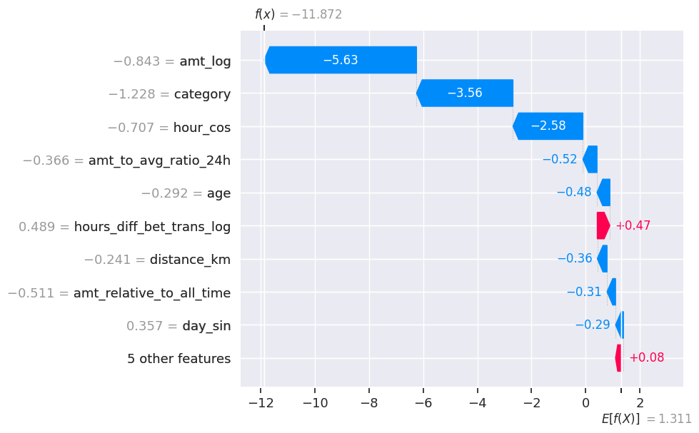
    


### **Transaction Analysis: Legitimate (Safe)**

The plot visualizes why the model decided this specific transaction (Index 0) was **Legitimate**.

* **Final Score (): -11.872**
* This is the model's raw output (log-odds).
* A highly negative score translates to a probability near **0%** (0.000007%).
* **Verdict:** The model is extremely confident this is **NOT fraud**.


* **Key Drivers (Why it's Safe):**
* **`amt_log` (Blue Bar, -5.63):** This is the massive blue bar pushing the score to the left. It indicates the **transaction amount was low**. In fraud detection, low amounts are strong indicators of normal behavior, and this feature alone did most of the work to clear this transaction.
* **`category` (Blue Bar, -3.56):** The merchant category (likely something like 'grocery_pos' or 'gas_transport' which had low WoE scores) heavily signaled safety.
* **`hour_cos` (Blue Bar, -2.58):** The time of day aligned with normal human activity patterns, further reducing risk.


* **Minor Risk Factors:**
* **`hours_diff_bet_trans_log` (Red Bar, +0.47):** There was a tiny push towards fraud here (perhaps the time since the last transaction was slightly shorter than average), but it was completely overwhelmed by the "safe" signals (Amount and Category).


```python
import pandas as pd
import numpy as np
import shap

# 1. Increase sample size to 2000 to ensure we capture the fraud case at index 1006
sample_size = 2000 

# 2. Get the numerical data for calculations
# We use the transformed data (from the pipeline) for the math
X_sample_nums = X_test_transformed[:sample_size]

# 3. Create the DataFrame for the plot (so we get nice feature names)
# Using the feature_names list we created earlier
X_sample_df = pd.DataFrame(X_sample_nums, columns=feature_names)

# 4. RE-GENERATE the Explanation Object for the larger sample
# This is the critical step that was missing
print(f"Calculating SHAP values for {sample_size} transactions...")
explanation = explainer(X_sample_df)

# 5. Find the fraud index within this new aligned range
# We slice y_test to match the exact size of the explanation object
sample_y_test = y_test[:sample_size].reset_index(drop=True)
fraud_indices = np.where(sample_y_test == 1)[0]

# 6. Plot the Waterfall
if len(fraud_indices) > 0:
    target_index = fraud_indices[0]
    print(f"Success! Plotting Fraud Case at Index: {target_index}")
    
    # Now explanation[1006] will exist because we calculated 2000 rows
    shap.plots.waterfall(explanation[target_index])
else:
    print("No fraud cases found in the first 2000 samples. You may need to increase sample_size to 5000.")
```

    Calculating SHAP values for 2000 transactions...
    Success! Plotting Fraud Case at Index: 1006


    
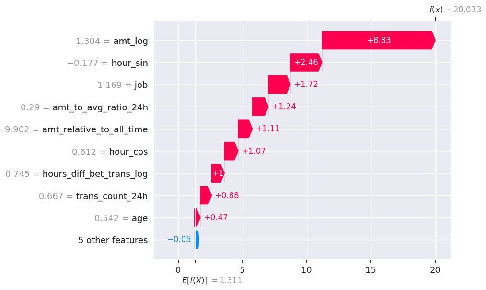
    


### **Interpretation of the Fraud Case (Index 1006)**

**1. The "Smoking Gun" Score**

* **Final Score ($f(x)$): 20.033**
* Compared to the legitimate transaction score of **-11.87**, this is a massive swing.
* A score of +20 translates to a probability of **99.999% Fraud**. The model has zero doubt about this transaction.


**2. The Anatomy of the Fraud (Red Bars)**
Every major feature pushed the score to the **right** (indicating higher risk).

* **`amt_log` (+8.83 Impact):** This is the dominant signal. The transaction amount (1.304 on the log scale) was the primary trigger. Fraudsters typically try to drain funds quickly, and your model has learned that high value = high risk.


* **`hour_sin` (+2.46 Impact):** The time of day was a strong risk factor. This likely occurred during the "night" window (0-4 AM) where you previously identified a high density of fraud.


* 
**`job` (+1.72 Impact):** The cardholder's profession had a high Weight of Evidence (WoE) score, suggesting this account type is historically targeted or susceptible.


* **`amt_to_avg_ratio_24h` (+1.24 Impact):** This is your **custom engineered feature** in action. It confirms the transaction was not just "large" in general, but large *relative to this specific user's recent history*. This proves the value of your behavioral feature engineering.
